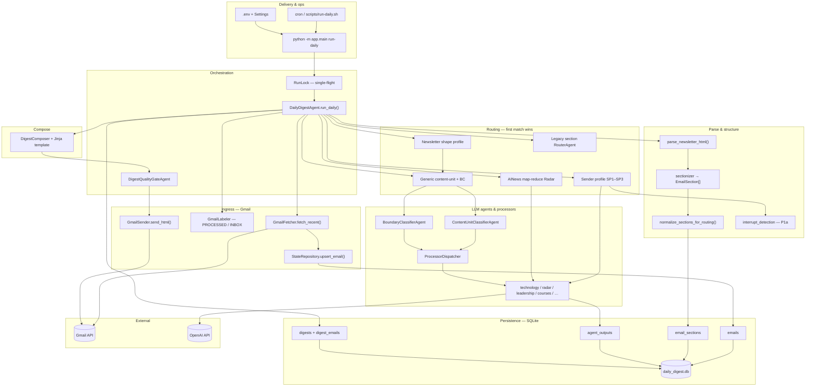
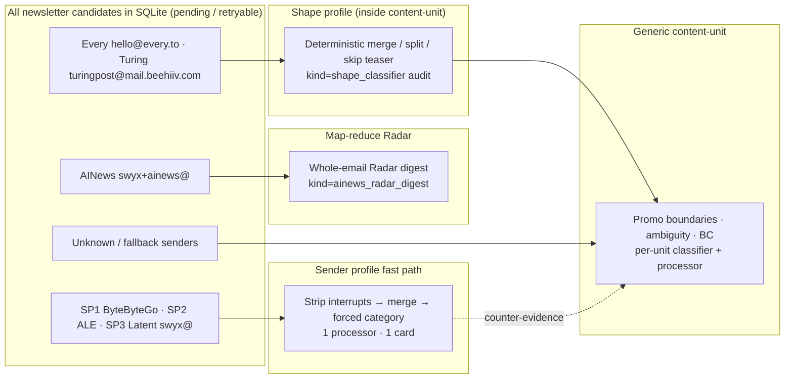
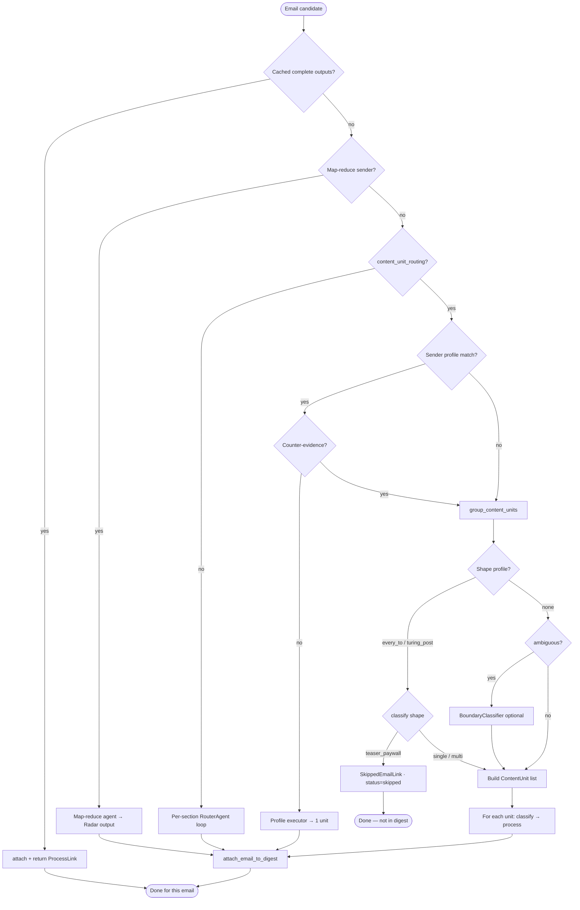
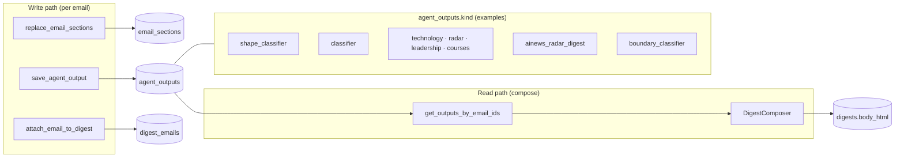
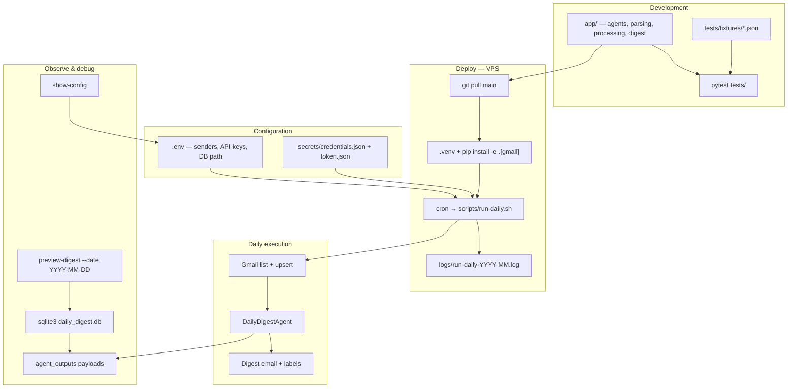
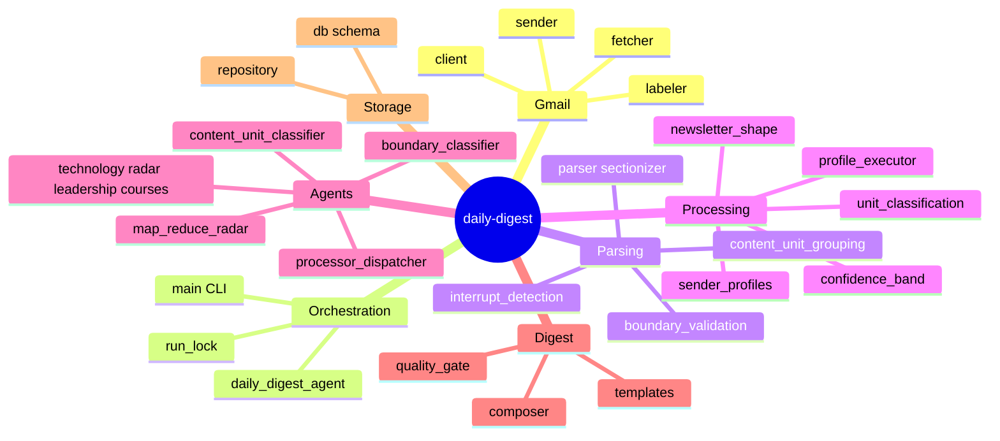
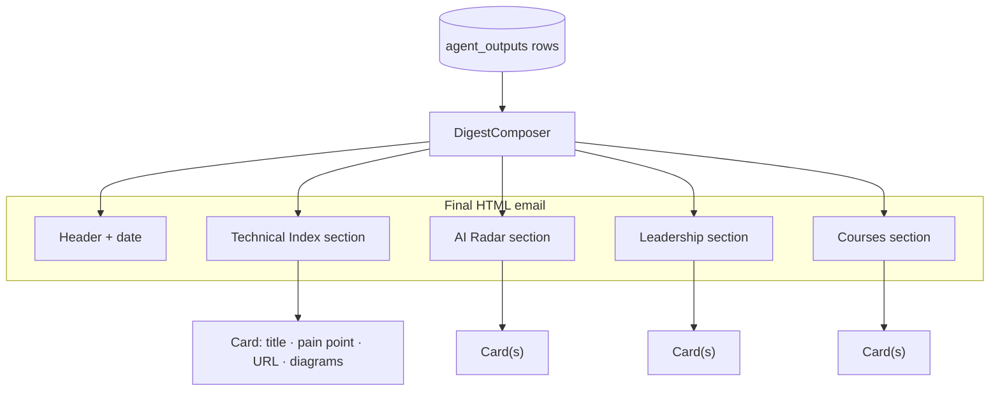

# Architecture & Engineering Flow

**Status:** **Implemented** (V1 production)  
**Audience:** Design review, onboarding, ops debugging  
**Source of truth:** `app/agents/daily_digest_agent.py`, `app/main.py`, `app/storage/`  
**Related:** [`pipeline-flowchart.md`](pipeline-flowchart.md), [`mixed-newsletter-shape-profile.md`](mixed-newsletter-shape-profile.md), [`sender-profiles.md`](sender-profiles.md)

This document is the **visual companion** to the step-by-step pipeline flowchart. It shows (1) layered system architecture, (2) how routing strategies overlap, and (3) the engineering lifecycle from cron to Gmail.

---

## 1. Layered system architecture

**Dependency rule:** Orchestration calls everything else; routing modules never call Gmail directly except through injected collaborators.

---

## 2. Routing strategy overlap (Venn view)

Four **mutually ordered** strategies handle incoming mail. A sender belongs to **at most one primary path** per run; shape profile and generic grouping only apply **inside** the content-unit branch.

| Set | Members (V1) | Classifier? | Typical cards |
|-----|----------------|-------------|---------------|
| **Map-reduce** | AINews | No (fixed Radar) | 1 Radar digest |
| **Sender profile** | ByteByteGo, ALE, Latent `swyx@` | No on happy path | 1 |
| **Shape + content-unit** | Every, Turing Post | Yes (per unit) | 1 (merged) |
| **Generic content-unit** | Everyone else; profile fallback | Yes | 1…N |

**Overlap clarification (not Venn intersections in production):**

- **Sender profile ∩ Shape profile** = ∅ (different senders today).
- **Shape profile ⊂ Content-unit path** — shape runs *before* classifier inside `_process_content_unit_email`.
- **Sender profile → Generic** only on structural counter-evidence (`promo_dominated`, `empty_body`).

---

## 3. Per-email decision tree (engineering logic)

---

## 4. Data & cache flow

**Cache hit:** `try_reuse_complete_outputs` / `profile_unit_outputs_cached` skips LLM when section hashes and output kinds align.

**Force reprocess:** `DELETE FROM agent_outputs WHERE email_id=?` + `UPDATE emails SET status='pending'`.

---

## 5. Engineering lifecycle (dev → prod)

| Stage | Command / artifact |
|-------|-------------------|
| Local test | `pytest tests/test_newsletter_shape_profile.py` |
| Manual run | `python -m app.main run-daily` |
| Prod schedule | `0 17 * * * …/scripts/run-daily.sh` |
| Inspect digest | `python -m app.main preview-digest --date 2026-06-16` |
| Clear stale cache | Delete `agent_outputs` for `email_id`, set `status=pending` |

---

## 6. Module map (code ↔ concern)

---

## 7. Digest output structure (downstream)

Each **card** maps to one `(email_id, content_unit_key)` processor row (or map-reduce digest row for AINews).

---

## 8. Changelog

| Date | Change |
|------|--------|
| 2026-06-16 | Initial architecture + Venn-style routing overlap + engineering lifecycle |
