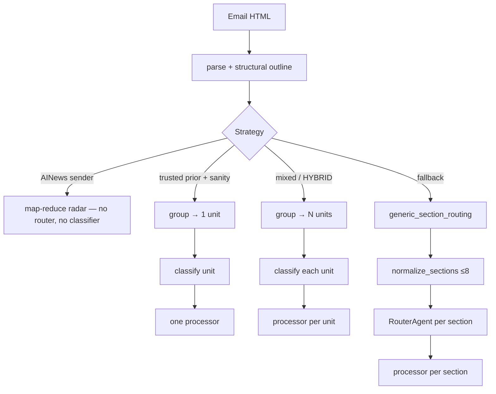
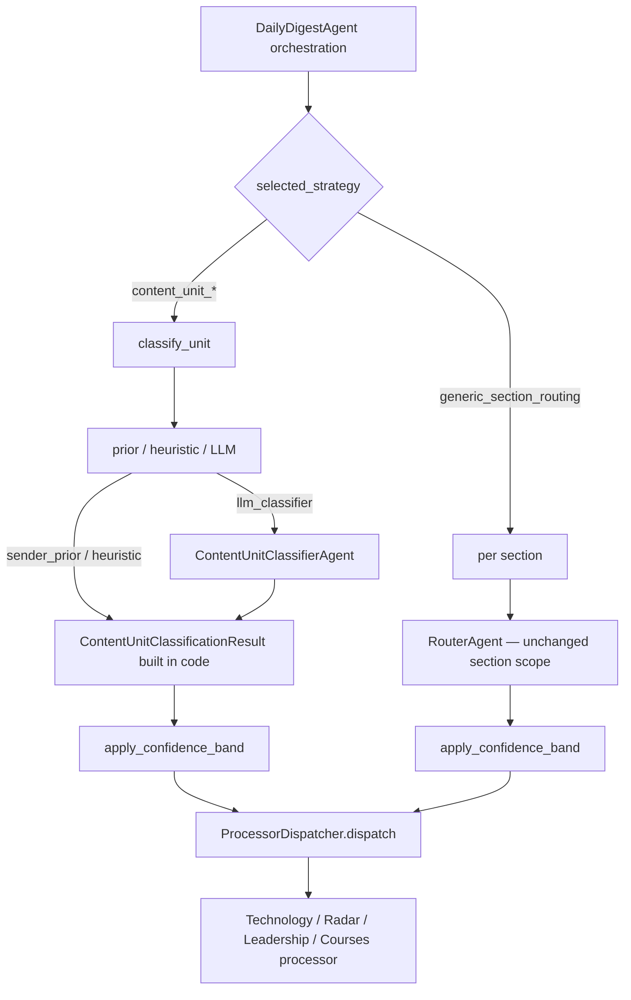

# Content-unit classification and extraction

**Status:** Design — prompts in `app/prompts/content_unit_*.md`; Phase 6 not wired.  

**Document map**

| Doc | Role |
|-----|------|
| [`content-unit-routing-design.md`](content-unit-routing-design.md) | Pipeline, phases 0–9, priors, pitfalls |
| **This file** | Classification rubric, policies §1–§10, Router vs classifier, Option B |
| [`milestone8-content-unit-routing.md`](../milestone8-content-unit-routing.md) | Phase 6 implementation checklist & tests |
| [`map-reduce-radar-design.md`](map-reduce-radar-design.md) | AINews hard override |
| [`app/prompts/README.md`](../app/prompts/README.md) | Prompt stems |

---

## Principle

**Classify once, extract once.**

Category assignment and digest extraction are separate steps. Processor prompts never re-classify, reject, or return `matches` / `confidence` metadata. That belongs only on classification results (`ContentUnitClassificationResult` or legacy `RouterDecision`).

```
group_content_units → classify unit → run one extract-only processor → persist outputs
```

---

## Router vs classifier

Both answer the same product question — **which of the four digest categories applies?** — but they operate on **different scopes** and are used on **mutually exclusive paths**. The same block of text is **not** routed by both.

### Side-by-side

| Dimension | **`RouterAgent` (live today)** | **Content unit classifier (Phase 6+)** |
|-----------|--------------------------------|----------------------------------------|
| **Input scope** | One persisted `email_section` slice (after `normalize_sections_for_routing`, ≤8 merges) | One **grouped content unit** (may span multiple raw sections) |
| **Visibility** | Sees only this slice’s heading + plain text | Sees merged unit text, unit headings, unit link candidates |
| **When used** | Default **`generic_section_routing`**; current production path for non-AINews senders | Trusted single-article priors; **mixed publications** (e.g. Every.to); HYBRID per-unit routing |
| **Who decides** | Almost always LLM (`router.md`) | Layered: `sender_prior` → `heuristic` → `llm_classifier` |
| **Output model** | `RouterDecision` (`category`, `confidence`, `rationale`) | `ContentUnitClassificationResult` (+ `primary_value`, `evidence`, `routing_source`, `warnings`) |
| **Classification rubric** | Section-local pulse vs explainer vs promo heuristics | **Primary reader value** four questions (see below) |
| **Downstream** | One processor per section | One processor per unit |
| **Persisted as** | `agent_outputs.kind = "router"` per section | `agent_outputs.kind = "classifier"` per unit (planned) |

### Pipeline placement



### Mental model

| Role | Job |
|------|-----|
| **Grouping** | Editor cuts the email into “stories” (content units) |
| **Classifier** | Labels each story with a digest column |
| **Router** | Fallback labeler when there are only DOM slices, not editorial units |
| **Processor** | Writes the digest card for the chosen column |

### Why not router-only?

1. **Long-form split by section cap** — one article becomes many slices; per-slice router calls disagree (TECHNOLOGY vs RADAR drift).
2. **Mixed publications** — one email contains RADAR + TECHNOLOGY + LEADERSHIP + COURSES units; router cannot see sibling context and may mis-cut at DOM boundaries.

### Primary reader value (classifier rubric)

| Category | Question |
|----------|----------|
| **RADAR** | What **changed in the outside world**? |
| **TECHNOLOGY** | What **durable technical pattern or system** should I remember? |
| **LEADERSHIP** | How should a **senior engineer, manager, or team change behavior**? |
| **COURSES** | Is this **primarily promotional / enrollment-oriented**? |

Illustrative examples (content-based, **not** URL rules): benchmark review → RADAR; AI employment essay → LEADERSHIP; context-engineering architecture → TECHNOLOGY; RSVP block → COURSES.

### Path exclusivity (same pattern as AINews)

AINews already demonstrates **early exit**: map-reduce Radar bypasses `RouterAgent` entirely (`docs/map-reduce-radar-design.md` §3.1). Content-unit routing extends that idea:

- **Content-unit path:** group → classify → processor (**no Router**)
- **Fallback path:** normalize sections → Router → processor (**no unit classifier**)
- **AINews path:** map-reduce only (**no Router, no unit classifier**)

---

## Classification model

```python
class ContentUnitClassificationResult(BaseModel):
    category: RouteCategory          # RADAR | TECHNOLOGY | LEADERSHIP | COURSES
    confidence: float                # 0.0–1.0
    rationale: str
    primary_value: str               # one-sentence reader takeaway type
    evidence: list[str]              # grounded phrases from unit text
    routing_source: ClassificationRoutingSource
    warnings: list[str] = []         # e.g. classification_low_confidence
```

`ClassificationRoutingSource`: `sender_prior` | `sender_override` | `heuristic` | `llm_classifier`

Extraction targets (unchanged): `RadarOutput`, `TechnologySectionOutput`, `LeadershipSectionOutput`, `CoursesOutput`.  
`TechnologySectionOutput.original_url` may be **`null`** when no candidate URL applies — no placeholder URLs.

Prompt stems (planned): `content_unit_classifier`, `content_unit_radar`, `content_unit_technology`, `content_unit_leadership`, `content_unit_courses`.

---

## Classification policy (normative — adopt before Phase 6)

These rules address misclassification, prior conflicts, observability, and grouping cascade failures.

### 1. Processors do not classify

Processor outputs must **not** include `matches`, `confidence`, or reject sentinels. Classification happens **before** extraction. Processors assume the category is already correct.

### 2. Low-confidence policy

Apply to the **effective confidence** of the classification step (from prior, heuristic, or LLM — whichever produced the final `ContentUnitClassificationResult`).

| Confidence | Action |
|------------|--------|
| **≥ 0.75** | Process normally: call the matching processor, attach outputs to digest composition. |
| **0.55 ≤ confidence < 0.75** | **Still process**, but append warning `classification_low_confidence` to `warnings` and record it on the persisted classifier row and in `EmailProcessingDecision` reasons when present. |
| **< 0.55** | **Do not call processor** for this unit. Mark unit status **`classification_failed`**. Do **not** treat this unit as composable. |

**Email-level attach rule (Phase 6 policy §8):**

- Phase 6 uses **per-email all-or-nothing**: if **any** content unit fails classification (`classification_failed`) **or** processor execution, **do not** attach the email to the digest for this run.
- Set `emails.status = 'failed'`, increment retry count, **do not** Gmail-archive or apply `AI_DIGEST_PROCESSED` for that message on this run.

Rationale: skipping a failed unit without failing the email would produce silent partial digests; failing the email keeps the message retryable and out of the inbox archive until all units succeed.

Thresholds **`0.75`** and **`0.55`** should be named constants (e.g. `CLASSIFIER_CONFIDENCE_PROCESS`, `CLASSIFIER_CONFIDENCE_MIN`) for tuning without prompt changes.

**Unified bands (Phase 6 policy §7):** the same three bands apply to **every** classification source — LLM classifier, sender prior, heuristic, and **`RouterDecision` on the fallback section path**. Map `RouterDecision.confidence` through the identical gate before calling a section processor.

### 3. Sender prior policy

| Prior type | Senders (examples) | Rule |
|------------|-------------------|------|
| **Hard override** | AINews (`swyx+ainews@…`) | Map-reduce Radar only. Classifier **cannot** override. Early exit before grouping/classifier. |
| **Soft prior** | ByteByteGo, A Life Engineered, Latent Space (non-AINews), Turing Post, … | Use prior category **only if** structural sanity check **trusts** the single-article assumption. `routing_source = sender_prior`. |
| **Sanity reject** | Soft prior + failed sanity | **Fall back** to `llm_classifier` (or `heuristic` for obvious promo blocks). Do not force prior category. |
| **No default category** | Every.to (`hello@every.to`) | `requires_archetype_detection`; **must** classify each unit by content / archetype. No sender-level default `TECHNOLOGY` or `LEADERSHIP`. |

When soft prior and LLM disagree, **LLM wins** if sanity was reject-tier; if sanity was trust-tier, **prior wins** unless `confidence` from a secondary check falls below `0.55`.

### 4. Persist classification decisions

Store **`ContentUnitClassificationResult`** as an agent output row:

| Column | Value |
|--------|--------|
| `kind` | `"classifier"` |
| `category` | chosen `RouteCategory` |
| `email_section_id` | `NULL` for unit-scoped rows **or** anchor section key (pick one convention in Phase 6 and document) |
| `content_unit_key` | stable unit id from grouping (recommended for multi-unit emails) |
| `payload` | JSON: `category`, `confidence`, `rationale`, `primary_value`, `evidence`, `routing_source`, `warnings`, optional `content_hash` |

Processor row follows for the same unit with `kind` in `PROCESSOR_OUTPUT_KIND[category]`.

This mirrors today’s `kind = "router"` persistence and enables cache reuse keyed on `(content_unit_key, content_hash, kind)`.

### 5. Replay and debug

Decision data must be **durable**, not only application logs:

- **`agent_outputs`** rows: `classifier` + processor per unit (and legacy `router` on fallback path).
- **`email_processing_decisions`** (SQLite): strategy, priors, sanity, grouping snapshot, per-unit classification summary, warnings, outcome.

Required for replay after prompt changes, investigating wrong digest cards, and comparing counterfactual strategies.

### 6. Grouping dependency

The classifier **assumes** content units are already grouped correctly. It must **not** compensate for bad merges.

Grouping policy when ambiguous: **prefer split over false merge**.

- Wrong merge → one classification for two stories → one wrong card (high damage).
- Wrong split → extra LLM calls → recoverable.

If grouping tier is **ambiguous**, run LLM **boundary** classifier (Phase 7) or conservative split **before** category classification — do not overload the category classifier with boundary repair.

---

## Phase 6 policies (normative)

Policies below extend §1–§6. They **guide Phase 6 implementation** but do **not** block shipping unless existing code explicitly violates them (today’s section-only pipeline is grandfathered until the content-unit path lands).

### 7. Unified confidence bands

**All classification sources** use the same three-band policy (§2):

| Source | Examples |
|--------|----------|
| `llm_classifier` | `content_unit_classifier` LLM output |
| `sender_prior` | Trusted ByteByteGo / ALE single-article prior |
| `heuristic` | Promo CTA density, recap structure, sponsor blocks |
| **`RouterAgent` (fallback)** | `RouterDecision.confidence` on `generic_section_routing` |

No separate thresholds per path. Non-LLM sources still produce a numeric **`confidence`** (§9) that flows through the same `≥ 0.75` / `0.55–0.75` / `< 0.55` gates before processor dispatch.

### 8. Per-email all-or-nothing attach

On the **content-unit path** (Phase 6):

- Process **all** units on an email in one orchestration pass.
- If **any** unit ends in `classification_failed` **or** processor failure (exception, validation error, empty required payload), the **entire email** fails for this digest run:
  - **Do not** `attach_email_to_digest`
  - **Do not** Gmail-archive or apply `AI_DIGEST_PROCESSED`
  - Set `emails.status = 'failed'`, increment retry count

Same spirit as Milestone 5’s section slice loop (all slices must succeed before attach). **Partial digests** (some units in, some out) are **not** supported on the content-unit path in Phase 6.

**Fallback section path:** existing all-or-nothing slice semantics unchanged — any section router/processor failure fails the email.

### 9. Non-LLM classification confidence

Heuristic and prior routes **must** set explicit `confidence` on `ContentUnitClassificationResult` (and should set equivalent semantics on persisted `RouterDecision` when bands apply to fallback):

| Route | `routing_source` | Default `confidence` | Band outcome |
|-------|------------------|----------------------|--------------|
| Hard override (AINews map-reduce) | `sender_override` | **1.0** | N/A — bypasses unit classifier; recorded if audit row exists |
| Accepted soft sender prior (sanity trust) | `sender_prior` | **0.9** | Normal (≥ 0.75) |
| Strong deterministic heuristic | `heuristic` | **0.85** | Normal (≥ 0.75) |
| Weak heuristic | `heuristic` | **0.65** | Process + `classification_low_confidence` warning |
| LLM classifier | `llm_classifier` | model output | Apply bands to model value |

Constants (suggested names): `CONFIDENCE_HARD_OVERRIDE`, `CONFIDENCE_SENDER_PRIOR`, `CONFIDENCE_HEURISTIC_STRONG`, `CONFIDENCE_HEURISTIC_WEAK`.

LLM outputs are **not** replaced by these defaults; they are calibrated separately via prompt and optional post-hoc tuning.

### 10. Composer rendering rules

`DigestComposer` renders a content unit **only** when **both** are true:

1. Classifier row exists with `kind = "classifier"`, confidence ≥ `CLASSIFIER_CONFIDENCE_MIN` (0.55), and unit status is **not** `classification_failed`.
2. Matching processor row exists for the same `content_unit_key` (or section key on fallback path) with `kind` consistent with `category`.

**Skip** units missing either row or marked `classification_failed`. Never synthesize placeholder cards.

**Relationship to §8:** under strict all-or-nothing attach, emails with any failed unit should **not** reach composition for the current digest. Composer skip rules are **defense in depth** for partial DB state, cache reuse, manual replay, or future policy changes — not an invitation to attach partial emails.

---

## Policy evaluation

Assessment of the proposed policy against the main Phase 6 risks.

### Overall verdict

**Adopt.** Policies §1–§10 form a coherent Phase 6 contract: unified gates, fixed non-LLM confidence, all-or-nothing attach, composer defense in depth. Grandfather the current section-only pipeline until the content-unit path ships; no pre-Phase-6 code change required unless an in-flight refactor touches attach/compose/confidence.

### By rule

| # | Proposal | Verdict | Notes |
|---|----------|---------|-------|
| **1** | No reject fields in processors | **Strong agree** | Already aligned with section processors (`radar.md` assumes router chose RADAR). Keeps Pydantic schemas stable. |
| **2** | Three-band confidence | **Agree with refinements** | **Good:** `< 0.55` skip processor avoids high-confidence garbage in the digest. **Good:** middle band processes but flags — balances recall vs observability. **Refine:** define email-level attach when any unit fails (see §2 above). **Refine:** calibrate thresholds on 20–30 labeled units; LLM confidence is often miscalibrated. **Clarify:** “do not archive” means no Gmail archive / no `AI_DIGEST_PROCESSED` on this run — use `failed` + retry, not leave message stuck `pending` silently. |
| **3** | Sender prior policy | **Strong agree** | Matches “priors are soft, not law” except AINews. Every “no default category” is essential. **Refine:** document explicit tie-break when trust-tier prior meets LLM disagree (prior wins unless secondary confidence `< 0.55`). |
| **4** | `kind = classifier` persistence | **Strong agree** | Parallels `router` rows; enables per-unit cache and composer joins. **Require:** `content_unit_key` (or equivalent) on multi-unit emails — `email_section_id` alone is insufficient when one unit spans sections. |
| **5** | Decision logs persisted | **Strong agree** | Logs alone are lost on redeploy. `email_processing_decisions` + `agent_outputs` duplication is intentional: decisions for orchestration, outputs for compose/replay. |
| **6** | Grouping not classifier’s job | **Strong agree** | “Split over merge” is the right bias. Category classifier input should include unit boundaries as **given**, not ask the model to re-segment. |

### Phase 6 batch (policies §7–§10)

| # | Policy | Verdict | Notes |
|---|--------|---------|-------|
| **7** | Unified confidence bands | **Strong agree** | Closes the “fallback path asymmetric” gap. Requiring `RouterDecision` to use the same gates avoids two quality bars. **Implementation:** one shared helper (e.g. `apply_confidence_band(result) → process \| warn \| fail`). |
| **8** | Per-email all-or-nothing | **Strong agree** | Matches Milestone 5 and §8. **Clarify:** “unit failure” = `classification_failed` **or** processor failure. **Tradeoff:** one bad unit blocks a whole Every.to issue — acceptable for Phase 6; retry is the relief valve. |
| **9** | Fixed heuristic/prior confidence | **Strong agree** | Makes bands executable for non-LLM routes. Prior `0.9` and strong heuristic `0.85` → normal band; weak `0.65` → auto warning. Hard override `1.0` is for AINews audit semantics (path skips unit classifier). |
| **10** | Composer skip failed units | **Agree — defense in depth** | Never render without classifier + processor pair. **Not** partial digest alongside §8. Emit compose warning if skipped rows exist on an attached email (steady state should not happen). |

### Risks explicitly mitigated

| Risk | Mitigation in policy |
|------|----------------------|
| Misclassification with no processor reject | `< 0.55` → no processor, email not attached |
| Silent quality degradation | `0.55–0.75` → `classification_low_confidence` warning |
| Prior vs LLM conflict | §3 precedence table |
| Every URL/title brittleness | No default category; content rubric only |
| Undebuggable wrong cards | §4 + §5 persisted classifier payload with `evidence` |
| Grouping cascade | §6 split-over-merge; boundary step separate from category |
| Asymmetric fallback quality bar | §7 unified bands on `RouterDecision` |
| Non-LLM routes bypassing confidence | §9 fixed prior/heuristic scores |
| Partial/stale rows in compose | §8 attach gate + §10 composer pair join |

### Remaining gaps (document, don’t block Phase 6)

1. **LLM confidence calibration** — Bands are fixed; model-reported confidence may need prompt tuning or scaling on 20–30 labeled units.
2. **Strong vs weak heuristic taxonomy** — §9 defines scores; Phase 6 must document which deterministic rules map to `0.85` vs `0.65` (e.g. promo CTA density thresholds).
3. **`content_unit_key` convention** — Required for composer pair join (§10) and classifier persistence (§4); pick anchor section vs synthetic key before wiring.

---

## Phase 6 wiring checklist

1. `ContentUnitClassifierAgent` → `ContentUnitClassificationResult`  
2. Shared `apply_confidence_band()` — §2 + §7 (all sources, including `RouterAgent`)  
3. §9 default confidence by `routing_source` / heuristic tier  
4. Apply §3 prior + sanity routing  
5. Persist §4 classifier rows + §5 decision events  
6. §8 all-or-nothing attach before `attach_email_to_digest`  
7. Map `category` → one extract-only processor prompt  
8. §10 composer join on `(content_unit_key, classifier + processor)`  
9. Integration tests: prior trust, sanity reject → LLM, low confidence → no processor, any unit fail → email not attached, Every multi-unit  

---

## Agent architecture decision (Phase 6)

**Decision: use Option B directly — do not repurpose `RouterAgent` (Option A).**

### Options considered

| | **Option A — repurpose `RouterAgent`** | **Option B — new `ContentUnitClassifierAgent`** |
|---|----------------------------------------|---------------------------------------------------|
| Idea | Same class name; swap prompt/schema to classify one content unit | New classifier agent; keep `RouterAgent` for fallback; add deterministic dispatcher |
| Pros | Fewer new files short-term | Clear separation of classify vs legacy section route vs dispatch |
| Cons | Name lies about scope; collides with fallback section path; double migration if renamed later | Slightly more wiring up front |

### Why not A (even as a temporary Phase 6 step)

Phase 6 runs **two paths in parallel**:

1. **Content-unit path** — classify **grouped units** → `ContentUnitClassificationResult` → persist `kind=classifier`
2. **Fallback section path** — classify **DOM sections** → `RouterDecision` → persist `kind=router`

Repurposing `RouterAgent` for (1) while (2) still needs section-scoped `router.md` forces a **dual-mode god object** (unit input vs section input, two schemas, two persist kinds). That is harder to reason about than two small agents. A-then-rename also implies **two breaking changes** (repurpose, then split) for the same end state as B.

### Target layout (Phase 6)



| Component | Role | Status Phase 6 |
|-----------|------|----------------|
| **`ContentUnitClassifierAgent`** | LLM classify **one content unit**; prompt `content_unit_classifier`; schema `ContentUnitClassificationResult` | **New** |
| **`RouterAgent`** | LLM classify **one section slice**; prompt `router`; schema `RouterDecision` | **Keep** — fallback only, frozen contract |
| **`ProcessorDispatcher`** | Deterministic `RouteCategory` → processor agent + `run_section` / unit extract | **New** (pure function or thin module) |
| Prior / heuristic classify | Build `ContentUnitClassificationResult` in parsing layer; **no agent** | **New** |

### Deprecation semantics

- **`RouterAgent` is not deleted in Phase 6.** It is **deprecated as the primary classifier** for trusted priors and mixed publications.
- **`RouterAgent` remains the fallback** for `generic_section_routing` until that strategy’s volume justifies merge or rename (e.g. optional later `SectionClassifierAgent` alias — **not** Phase 6 scope).
- Do **not** overload `RouterAgent.run()` with content-unit parameters “temporarily.”

### Persistence mapping

| Path | Classification agent | `agent_outputs.kind` |
|------|---------------------|----------------------|
| Content-unit | `ContentUnitClassifierAgent` (or prior/heuristic, no LLM) | `classifier` |
| Fallback section | `RouterAgent` | `router` (unchanged) |

Both paths call the same **`apply_confidence_band()`** and **`ProcessorDispatcher`** (policy §7).

### Implementation order (when coding starts)

1. `ProcessorDispatcher` + shared confidence band helper  
2. `ContentUnitClassifierAgent` + unit input formatter  
3. Wire content-unit orchestration branch in `DailyDigestAgent`  
4. Apply confidence bands to existing `RouterAgent` fallback (policy §7)  
5. Composer join on `content_unit_key` + `(classifier, processor)` pairs  

No Phase 6 task to “migrate RouterAgent into classifier”; skip Option A entirely.

---

## Files (planned)

| File | Role |
|------|------|
| `app/prompts/content_unit_classifier.md` | LLM category classification |
| `app/prompts/content_unit_*.md` | Extract-only processors |
| `app/models/content_units.py` | `ContentUnitClassificationResult`, grouping, decisions |
| `app/parsing/content_unit_grouping.py` | Deterministic unit boundaries |
| `app/agents/content_unit_classifier_agent.py` | LLM unit classifier (Phase 6) |
| `app/agents/processor_dispatcher.py` | `RouteCategory` → processor (Phase 6) |
| `app/processing/confidence_band.py` | `apply_confidence_band()` (Phase 6) |
