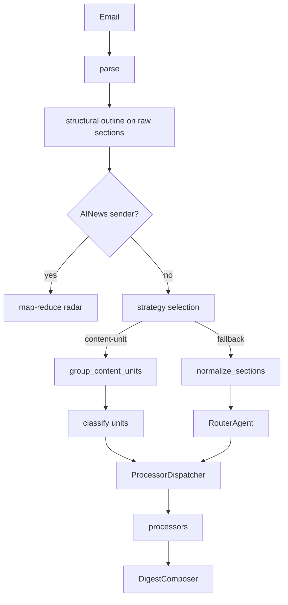

# Content-unit routing — architecture & phases

**Status:** Design — Phases 0–4 planned/partial in branch work; **Phase 6 not wired in production**.  
**Normative classification policy:** [`docs/content-unit-classifiers.md`](content-unit-classifiers.md) (policies §1–§10, agent architecture Option B).  
**Related:** [`docs/map-reduce-radar-design.md`](map-reduce-radar-design.md), [`milestone5.md`](../milestone5.md) (live section pipeline), [`milestone8-content-unit-routing.md`](../milestone8-content-unit-routing.md) (Phase 6 implementation spec).

---

## 1. Problem

The default pipeline (`normalize_sections_for_routing` → **`RouterAgent` per section** → processor) works for many newsletters but fails two patterns:

1. **Long-form single article** split across many DOM sections (section cap, inconsistent per-slice categories).
2. **Mixed publications** (e.g. Every.to) — one email contains RADAR + TECHNOLOGY + LEADERSHIP + COURSES blocks.

**Principle:** Sender rules are **priors**, not hard laws — except **AINews map-reduce** (hard Radar-only early exit).

---

## 2. Target pipeline

```
parse → raw sections → structural outline → sender prior → sanity check
    → group_content_units → classify each unit → ProcessorDispatcher → processors
    → compose (pair join) → quality gate → send
```

**Fallback** when prior/sanity/grouping does not trust content-unit path:

```
parse → normalize_sections_for_routing (≤8) → RouterAgent per section
    → apply_confidence_band → ProcessorDispatcher → processors
```

**AINews** (unchanged): early exit to map-reduce Radar — no grouping layer, no unit classifier, no section router.



Sanity / grouping must run on **raw sections**, not on `normalize_sections_for_routing` output (≤8 merge distorts long-form signals).

---

## 3. Path exclusivity

| Path | Classify | Extract | Persist classification as |
|------|----------|---------|----------------------------|
| AINews map-reduce | N/A (Radar-only) | map-reduce agent | `ainews_radar_digest` |
| Content-unit | prior / heuristic / **`ContentUnitClassifierAgent`** | extract-only unit prompts | `kind=classifier` |
| Fallback section | **`RouterAgent`** | section processors | `kind=router` |

Same text is **never** classified by both unit classifier and `RouterAgent`.

See [`content-unit-classifiers.md` § Router vs classifier](content-unit-classifiers.md#router-vs-classifier).

---

## 4. Phase 6 agents (Option B — decided)

| Component | Role |
|-----------|------|
| **`ContentUnitClassifierAgent`** | LLM classify one grouped unit (`content_unit_classifier.md` → `ContentUnitClassificationResult`) |
| **`RouterAgent`** | **Keep** — fallback only; one DOM section → `RouterDecision` |
| **`ProcessorDispatcher`** | Deterministic `RouteCategory` → processor agent + prompt |
| **`apply_confidence_band()`** | Shared gate for **all** sources (policy §7) |
| Prior / heuristic | Build `ContentUnitClassificationResult` in parsing code — no LLM |

**Do not** repurpose `RouterAgent` as the unit classifier (Option A rejected).

---

## 5. Data contracts (planned modules)

| Module | Purpose |
|--------|---------|
| `app/models/content_units.py` | `ContentUnit`, `ContentUnitClassificationResult`, `EmailProcessingDecision`, enums |
| `app/parsing/primary_links.py` | Link classes for outline / grouping |
| `app/parsing/structural_outline.py` | `build_structural_outline()` on raw sections |
| `app/parsing/sender_priors.py` + `config/sender_priors.json` | Soft priors registry |
| `app/parsing/single_essay_sanity.py` | Three-tier sanity (trust / ambiguous / reject) |
| `app/parsing/content_unit_grouping.py` | `group_content_units()` — Phase 5 |
| `app/processing/decision_events.py` | Persist `email_processing_decisions` |
| `app/agents/content_unit_classifier_agent.py` | Phase 6 LLM classifier |
| `app/agents/processor_dispatcher.py` | Phase 6 dispatch helper |

### `content_unit_key` (Phase 6 convention)

Stable id per grouped unit on an email, e.g. `u0`, `u1`, … assigned at grouping time in reading order.

- Used on `agent_outputs.content_unit_key` (new column or metadata — implement in Phase 6).
- Composer joins `(email_id, content_unit_key, kind=classifier)` with matching processor row.
- Fallback section path continues to use `email_section_id` only.

---

## 6. Sender priors (soft)

| Sender | Archetype / notes |
|--------|-------------------|
| `bytebytego@substack.com` | Single essay → TECHNOLOGY when sanity trusts |
| `alifeengineered@substack.com` | Single essay → LEADERSHIP when sanity trusts |
| `swyx@substack.com` (not `swyx+ainews`) | Interview transcript → TECHNOLOGY + interview processor hint |
| Turing Post / Beehiiv | Technical explainer domains |
| `hello@every.to` | **Mixed** — no default category; per-unit classify |
| `swyx+ainews@substack.com` | **Hard** map-reduce Radar only |

Every.to: classify by **primary reader value**, not URL column names (`vibe-check`, `context-window`, etc.).

---

## 7. Phase map

| Phase | Deliverable | Live digest impact |
|-------|-------------|-------------------|
| **0** | Pydantic contracts (`content_units.py`) | None |
| **1** | Primary links + structural outline | None |
| **2** | `email_processing_decisions` SQLite + log-only events | None |
| **3** | Sender prior registry | None |
| **4** | Sanity check (log-only counterfactual) | None |
| **5** | `group_content_units()` deterministic | None |
| **6** | Live routing switch + classifier + dispatcher + compose | **Yes** |
| **7** | LLM boundary classifier (ambiguous grouping only) | Ambiguous emails |
| **8** | LINK_AGGREGATOR map-reduce reuse | Optional |
| **9** | Golden fixtures, CLI inspect, tuning | Hardening |

**Phase 6 implementation spec:** [`milestone8-content-unit-routing.md`](../milestone8-content-unit-routing.md).

---

## 8. Phase 6 policies (summary)

Full normative text: [`content-unit-classifiers.md`](content-unit-classifiers.md).

| # | Policy |
|---|--------|
| §1 | Processors do not classify |
| §2–§7 | Unified confidence bands (`≥0.75` normal, `0.55–0.75` warn, `<0.55` fail) on **all** sources including `RouterAgent` |
| §8 | Per-email **all-or-nothing** attach |
| §9 | Fixed non-LLM confidence (prior 0.9, strong heuristic 0.85, weak 0.65) |
| §10 | Composer renders only classifier + processor pairs |

---

## 9. Pitfalls (documented)

- **Raw vs capped section order** — outline/grouping on raw; routing fallback on capped.
- **Same URL ≠ same unit** — AINews proved one URL can hold multiple editorial blocks.
- **HYBRID detection** — sponsor + essay + link dumps; prefer split over false merge.
- **Cache reuse** — must still emit processing decisions.
- **AINews** must not enter generic grouping layer.

---

## 10. Document index

| Doc | Contents |
|-----|----------|
| [`content-unit-classifiers.md`](content-unit-classifiers.md) | Classification rubric, policies §1–§10, Router vs classifier, Option B |
| [`map-reduce-radar-design.md`](map-reduce-radar-design.md) | AINews hard override |
| [`app/prompts/README.md`](../app/prompts/README.md) | Prompt stems including content-unit |
| [`milestone8-content-unit-routing.md`](../milestone8-content-unit-routing.md) | Phase 6 tasks & tests |

---

*Document version: 2026-06-04*
