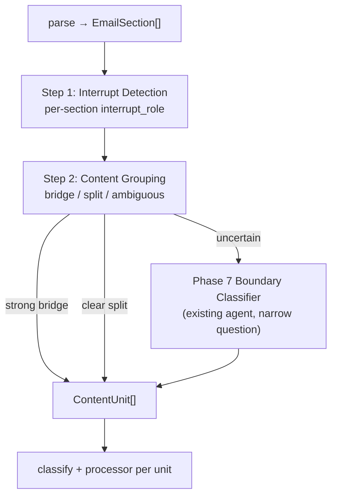

# Interrupt Detection & Content Grouping — Design Spec

**Status:** Planned (replaces promo **hard-boundary** policy in `group_content_units`)  
**Scope:** Content-unit path only — **publication-agnostic**, no new LLM agents  
**Out of scope:** AINews / `MAP_REDUCE_RADAR_SENDERS` — unchanged ([`map-reduce-radar-design.md`](map-reduce-radar-design.md))  
**Related:** [`milestone8-content-unit-routing.md`](../milestone8-content-unit-routing.md), [`phase7.1-backlog.md`](phase7.1-backlog.md), `app/parsing/content_unit_grouping.py`, `app/agents/boundary_classifier_agent.py`

---

## 1. Problem

Mid-newsletter **interrupts** (sponsored blocks, navigation chrome, subscription CTAs, footers) sit between parts of a **single article**. Today `is_promo_section()` (keyword ≥2 hits) marks interrupts as **hard boundaries**, splitting one essay into multiple content units and multiple digest cards.

**Target:** Treat interrupts as **labeled, removable structure** — not absolute merge walls. Grouping decides whether content **before and after** an interrupt belongs to the same content unit.

**Explicitly not in scope for this spec:** a new `InterruptAnnotator` LLM agent or any additional agent. Interrupt roles are **deterministic**; ambiguity goes to the **existing** Phase 7 `BoundaryClassifierAgent`.

**Layering:** Known senders use **[`sender-profiles.md`](sender-profiles.md)** fast path (merge strategy + forced category + dedicated processor). This document defines the **shared** interrupt detection and generic-fallback grouping. Profiles call interrupt detection first; they do not reimplement promo/footer stripping.

---

## 2. AINews — unchanged

```
_process_one_email()
  → sender in MAP_REDUCE_RADAR_SENDERS?
      yes → _process_map_reduce_radar_email()   # no interrupt detection, no grouping
      no  → _process_content_unit_email()       # this spec applies
```

No changes to AINews map-reduce, boundaries, or composer Radar paths.

---

## 3. Two-step pipeline



| Step | Question | Mechanism |
|------|----------|-----------|
| **1. Interrupt Detection** | What role does each section play? | High-precision **deterministic** rules |
| **2. Content Grouping** | Do sections on either side of an interrupt form **one** content unit? | Structure evidence → merge; blockers → split; gray → **existing BC** |

---

## 4. Step 1 — Interrupt Detection

### 4.1 Roles

```python
class InterruptRole(StrEnum):
    NORMAL_CONTENT      = "normal_content"
    PROMO               = "promo"
    NAVIGATION          = "navigation"
    SUBSCRIPTION_CTA    = "subscription_cta"
    FOOTER              = "footer"
    UNKNOWN_INTERRUPT   = "unknown_interrupt"
```

| Role | Meaning |
|------|---------|
| `NORMAL_CONTENT` | Article body, front matter, chapter headings — default |
| `PROMO` | Sponsored / third-party product promotion |
| `NAVIGATION` | Email chrome: view in browser, share, read in app |
| `SUBSCRIPTION_CTA` | Subscribe / upgrade / paid tier pitch for **this newsletter** |
| `FOOTER` | Unsubscribe, preferences, legal, address lines |
| `UNKNOWN_INTERRUPT` | Possibly non-body, but **insufficient evidence** — do not force `PROMO` |

Every section gets exactly one role. Persist on outline / `GroupingResult` for audit and Phase 7 input.

### 4.2 Detection policy

**Bias: precision over recall.** False `PROMO` is worse than `UNKNOWN_INTERRUPT`.

Evaluate rules in **priority order** (first match wins). Implementation: `detect_interrupt_role(section) -> InterruptRole`.

#### `FOOTER` (high precision)

| Signal |
|--------|
| Heading or text matches `UNSUBSCRIBE_FOOTER_PHRASES` / footer rules in `app/parsing/rules.py` |
| `unsubscribe`, `manage preferences`, `email preferences`, `© 20`, postal-address patterns |
| Section in bottom 10% of email **and** link density to ESP/footer hosts |

#### `NAVIGATION` (high precision)

| Signal |
|--------|
| Heading/text: `read in app`, `view in browser`, `read online`, `share this` |
| Section char_count < ~200 **and** ≥2 navigation-style links, no substantive prose |
| Repeated subject line + date + `READ IN APP` pattern (email header chrome) |

#### `SUBSCRIPTION_CTA` (high precision)

| Signal |
|--------|
| Heading/text: `subscribe`, `sign up`, `become a paid subscriber`, `upgrade your subscription` |
| Refers to **this publication** (not a third-party product) |
| Short block, single CTA to substack.com/subscribe or similar |

#### `PROMO` (high precision only)

| Signal | Notes |
|--------|-------|
| Heading contains `(sponsored)`, `sponsor:`, `paid partnership` | **Strong** — sufficient alone |
| Heading contains `advertisement` / `promoted by` | **Strong** |
| Section was under `SPONSOR_CLASS_SUBSTRINGS` in HTML **and** survived as its own section | **Strong** if still present post-sectionize |
| Short block + external product CTA + topic **diverges** from subject tokens | Needs **all three** — not keyword count alone |

**Do not** classify `PROMO` from body keyword hits alone (`register`, `webinar`, …). Those → `UNKNOWN_INTERRUPT` at most.

#### `UNKNOWN_INTERRUPT`

| When |
|------|
| 1 promo keyword hit but no strong `PROMO` signal |
| Short ambiguous CTA block that fails `PROMO` / `SUBSCRIPTION_CTA` thresholds |
| Structural oddity (very short, link-heavy) without footer/nav match |

#### `NORMAL_CONTENT`

Default when no interrupt rule fires.

### 4.3 Deprecations

| Old | New |
|-----|-----|
| `is_promo_section()` (≥2 keyword hits) | `interrupt_role == PROMO` (strong signals only) |
| `is_hard_boundary_section()` | **Removed** — interrupts are not hard boundaries |

Weak keyword promo detection moves to `UNKNOWN_INTERRUPT`, not forced ad classification.

---

## 5. Step 2 — Content Grouping

### 5.1 Interrupt handling in grouping

For each interrupt section `I` at index `i` with adjacent non-interrupt runs:

```
pre_run  = maximal NORMAL_CONTENT (and optionally UNKNOWN_INTERRUPT*) run before I
post_run = maximal NORMAL_CONTENT (*) run after I
```

\* `UNKNOWN_INTERRUPT` sections **do not** break runs for bridge evaluation unless later reclassified; they stay as their own singleton units unless BC merges them. (Default: singleton `unknown_interrupt` unit, not bridged across.)

**Interrupt sections never join `unit_text` of article units.** They always become separate units (or filtered).

### 5.2 Bridge decision (deterministic)

`evaluate_interrupt_bridge(pre_run, post_run, *, email_original_url) -> BridgeDecision`

| Outcome | When |
|---------|------|
| **`BRIDGE`** | Strong continuity evidence; no blockers |
| **`SPLIT`** | Clear blockers — two independent contents |
| **`AMBIGUOUS`** | Insufficient evidence either way → Phase 7 BC |

#### Blockers → `SPLIT`

| ID | Condition |
|----|-----------|
| `MULTIPLE_PRIMARY_URLS` | `collect_primary_article_url_keys(pre + post)` size ≥ 2 |
| `PRE_IS_SUBSTANTIVE_BODY` | `pre_run` alone passes `_looks_like_single_long_form` with ≥3 sections |
| `PRE_HAS_TERMINATION` | Conclusion markers in pre tail |
| `POST_IS_NEW_STORY` | Post opens as unrelated standalone article |
| `AGGREGATOR_SHAPE` | Pre and post each resemble independent digest cards |
| `COLUMN_DIGEST_SHAPE` | Every-style column labels (orthogonal rule) |

#### Strong continuity → `BRIDGE`

| ID | Condition |
|----|-----------|
| `F1_PRE_IS_FRONT_MATTER` | Pre total chars < ~800; no numbered chapters |
| `F2_PRE_NOT_TERMINAL` | No conclusion markers in pre |
| `F3_SINGLE_CANONICAL_URL` | One primary URL across pre + post + `email_original_url` |
| `F4_POST_HAS_BODY_STRUCTURE` | ≥2 topic h2s or numbered chapters in post |
| `F5_POST_CONTINUES` | Post first section is not email header chrome |
| `F6_MERGED_LONG_FORM` | `_looks_like_single_long_form(pre + post)` |

**`BRIDGE` gate:** zero blockers **and** ≥4 of F1–F6 **and** F3 + F6 both true.

#### `AMBIGUOUS`

Gray score band, conflicting signals, or `UNKNOWN_INTERRUPT` between runs with weak pre/post evidence.

### 5.3 Unit assembly after grouping

| Unit kind | `section_keys` | `interrupt_role` (unit-level) | Digest |
|-----------|----------------|-------------------------------|--------|
| **Article** | Bridged or merged non-interrupt group | — | Normal classify + processor |
| **Promo interrupt** | `[s2]` | `promo` | COURSES or **hidden** (default hidden) |
| **Nav / footer / subscription** | singleton | matching role | **hidden** |
| **Unknown interrupt** | singleton | `unknown_interrupt` | hidden unless BC merges into article |

Article unit fields:

```python
unit_role: Literal["article", "interrupt"]
interrupt_roles_spanned: list[str]   # e.g. ["promo"] — interrupts bridged over, not in unit_text
bridge_source: Literal["deterministic", "boundary_classifier"] | None
```

### 5.4 Reference: Salesforce email (#163)

**After Step 1:**

| Section | Role |
|---------|------|
| s0 | `NORMAL_CONTENT` (dek) |
| s1 | `NAVIGATION` or `NORMAL_CONTENT` (title repeat / READ IN APP — rule-tuned) |
| s2 | `PROMO` — heading `(Sponsored)` |
| s3–s20 | `NORMAL_CONTENT` |

**After Step 2:**

```
Technology article unit:  s0, s1, s3–s20   (BRIDGE across s2)
Promo interrupt unit:     s2               → COURSES or hidden
```

One Technology card in digest. Promo does not fracture the essay.

---

## 6. Phase 7 Boundary Classifier — narrowed scope

**No new agent.** Extend **input** to existing `BoundaryClassifierAgent`; optionally narrow **when** it is called.

### 6.1 What BC sees

Outline entries include precomputed role (not re-derived by LLM):

```
[s0] (no heading) — 1613 chars — interrupt_role: normal_content
[s1] "What Salesforce Learned..." — 93 chars — interrupt_role: navigation
[s2] "WorkOS launches auth.md (Sponsored)" — 1103 chars — interrupt_role: promo
[s3] "What is Salesforce?" — 2393 chars — interrupt_role: normal_content
...
```

Interrupt sections appear in the outline **for context** but are **excluded** from `section_keys` in article units the LLM proposes.

### 6.2 The only question BC answers here

When `evaluate_interrupt_bridge` returns `AMBIGUOUS` for a `(pre_run, post_run)` pair across interrupt `I`:

> **Do the sections in `pre_run` and `post_run` belong to the same content unit?**

BC does **not**:

- Re-label interrupt roles
- Re-segment the whole email
- Output RADAR / TECHNOLOGY / LEADERSHIP / COURSES
- Classify sponsor names

BC **may** output a single article unit whose `section_keys` are `pre_run ∪ post_run` (non-contiguous in raw index — promo indices skipped), or keep them split.

### 6.3 When BC runs (unchanged + bridge)

| Trigger | BC scope |
|---------|----------|
| `bridge == AMBIGUOUS` | **Bridge question** for that pre/post pair only |
| `GroupingResult.ambiguous` (existing) | Non-interrupt run internal grouping (Every gray zone) |
| Clear `BRIDGE` or `SPLIT` | **No BC** for that pair |

Prompt updates (`boundary_classifier.md`, `format_boundary_classifier_input`):

- Replace `Hard boundary sections (do not merge across)` with `Interrupt sections (context only; excluded from unit section_keys): …`
- Add rule: article units may **skip** interrupt indices in raw order
- Remove old rule: every unit must be contiguous in raw order **when bridging across interrupts**

Validation updates:

- Remove `spans_hard_boundary` for promo
- Add: article unit must not contain `interrupt_role in {promo, navigation, footer, subscription_cta}`
- Add: bridged unit indices may have gaps only at interrupt positions

---

## 7. Classification & composer (downstream)

| `unit_role` | Classify | Processor | Composer |
|-------------|----------|-----------|----------|
| `article` | `ContentUnitClassifierAgent` | Normal | Normal |
| `interrupt` + `PROMO` | Heuristic `COURSES` or skip | Skip or light courses | **hidden** (default) |
| `interrupt` + nav/footer/subscription | Skip | Skip | **hidden** |
| `interrupt` + `UNKNOWN_INTERRUPT` | Skip unless merged into article | Skip | **hidden** |

On the **profile fast path**, interrupt detection is shared; profile strategy merges all `NORMAL_CONTENT` without bridge/BC (e.g. ByteByteGo `SINGLE_TECH_ARTICLE`). Bridge rules in §5 apply to **generic fallback** and profiles that opt into them (e.g. Turing Post when MAIN/ROUNDUP is unclear).

---

## 8. Orthogonal rules (unchanged)

| Rule | Role |
|------|------|
| Primary URL only (`primary_links.py`) | Multi-story aggregators |
| Column digest detection | No false merge on shared URL |
| Bias: split over false merge | Default when bridge `AMBIGUOUS` and BC low confidence |

---

## 9. Implementation checklist

| File | Change |
|------|--------|
| `app/parsing/interrupt_detection.py` | **New** — `InterruptRole`, `detect_interrupt_role()` |
| `app/parsing/content_unit_grouping.py` | Step 1 roles → Step 2 bridge; remove hard boundary |
| `app/parsing/boundary_validation.py` | Bridged gaps allowed; no promo span error |
| `app/agents/_prompts.py` | Outline includes `interrupt_role`; bridge-oriented BC copy |
| `app/prompts/boundary_classifier.md` | Narrow scope + non-contiguous bridged units |
| `app/agents/daily_digest_agent.py` | BC trigger for `bridge==AMBIGUOUS`; **no** map-reduce changes |
| `app/processing/unit_classification.py` | Route by `unit_role` / interrupt role |
| `app/digest/composer.py` | Filter interrupt units |
| `app/models/content_units.py` | `InterruptRole`, `BridgeDecision`, outline fields |

**Do not add:** `InterruptAnnotator`, new LLM agents, Markdown block segmentation.

---

## 10. Tests (shape-based)

| Fixture | Step 1 | Step 2 |
|---------|--------|--------|
| `single_essay_mid_sponsor` | s2=`PROMO` | BRIDGE → 1 article + 1 promo unit |
| `body_mentions_register_once` | `NORMAL_CONTENT` (not PROMO) | — |
| `dual_story_mid_sponsor` | s2=`PROMO` | SPLIT |
| `tail_webinar_cta` | last=`PROMO` or `UNKNOWN` | no bridge (no post) |
| `every_multi_url` | — | SPLIT / existing ambiguous BC |
| `ainews_issue` | not invoked | map-reduce only |

Regression: ByteByteGo Salesforce → exactly **one** Technology unit spanning s0–s1 and s3–s20.

---

## 11. Rollout

| Phase | Deliverable |
|-------|-------------|
| **P1a** | `interrupt_detection.py` + tests |
| **P1b** | Grouping bridge/split + unit assembly |
| **P1c** | BC prompt/validation/orchestrator for bridge ambiguity |
| **P1d** | Classifier short-circuit + composer filter |

Ship separately from Phase 7.1 ambiguous-trigger tightening.

---

## 12. Summary

1. **Interrupt Detection** — deterministic roles; high-precision `PROMO`; uncertain → `UNKNOWN_INTERRUPT`, never forced ad.
2. **Content Grouping** — strong evidence bridges across interrupts; blockers split; gray → **existing** Phase 7 BC with a **narrow** same-unit question.
3. **No new LLM agent** — BC sees roles as context, does not re-annotate the email.
4. **AINews** — untouched.
5. **Salesforce target** — one Technology unit `s0–s1 + s3–s20`, promo unit `s2` filtered aside.

---

*Created: 2026-06-05 — supersedes promo hard-boundary policy; replaces draft `promo-bridge-grouping.md`.*
