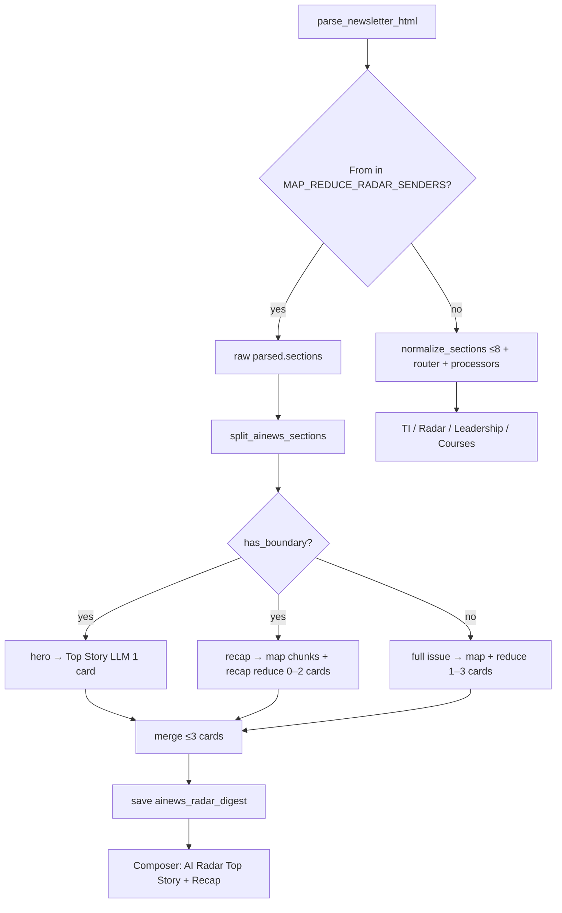

# AINews / Map-Reduce Radar — Design & Operations

This document describes how **long Radar newsletters** (initial sender: **AINews**, `swyx+ainews@substack.com`) are processed: the **RADAR-only hybrid synthesizer** (Top Story + Recap), hero/recap **boundary detection**, persistence, email rendering, configuration, and tests.

**Status:** Implemented  
**Code:** `app/agents/ainews_radar_map_reduce_agent.py`, `app/parsing/ainews_boundaries.py`, `app/parsing/map_reduce_chunks.py`, `app/parsing/sender_match.py`, `app/agents/daily_digest_agent.py`, `app/digest/composer.py`

---

## 1. Product rules (AINews)

| Rule | Behavior |
|------|----------|
| **Sender** | `swyx+ainews@substack.com` (and any address in `DAILY_DIGEST_MAP_REDUCE_RADAR_SENDERS`) |
| **Digest category** | Always **AI Radar** — never Technical Index, never Leadership |
| **No section router** | `RouterAgent` is **not** called for matched senders |
| **No TI / Leadership processors** | `TechnologyProcessorAgent` and `LeadershipProcessorAgent` are **not** called |
| **Output kind** | One email-level row: `kind=ainews_radar_digest`, `category=RADAR` |
| **Cards** | **1–3** thematic cards total — **not** one card per original section |
| **Internal split** | Optional **Top Story** (hero) + **Recap** cards when a recap boundary exists |
| **Hero is still Radar** | Top Story is **not** Technical Index; it is a `top_story` card under AI Radar |

---

## 2. Background: default pipeline vs AINews

### 2.1 Default (non–map-reduce senders)

1. `parse_newsletter_html` → raw `EmailSection` list  
2. `normalize_sections_for_routing` → **≤ 8** routing sections (`MAX_SECTIONS_PER_EMAIL`)  
3. Per section: **Router** → **Processor** (`radar`, `technology`, `leadership`, `courses`)  
4. `DigestComposer` renders one block per section-level processor row  

### 2.2 Why AINews is different

AINews issues often have **20+ DOM sections**. The default path yields many LLM calls and a digest that reads like a **section directory**. AINews instead uses a dedicated **map-reduce hybrid** path on **raw** `parsed.sections` (not the 8-section routing merge).

---

## 3. Architecture



### 3.1 Path exclusivity

For **map-reduce senders**:

- **Bypass** `normalize_sections_for_routing` for LLM work (sections are still stored raw in `email_sections` for audit).  
- **No** per-section `router` / `radar` / `technology` / `leadership` processors.  
- **`clear_section_scoped_agent_outputs`** removes legacy section-level rows on reprocess.  
- **Reuse:** if sender matches but no cached digest, **do not** reuse old per-section `router`+`radar` cache.  
- **Composer:** if `ainews_radar_digest` exists for an `email_id`, **skip** section-level `radar` rows for that email.

### 3.2 Section inputs

| Use | Source |
|-----|--------|
| Map-reduce / boundary split | `list(parsed.sections)` from DOM sectionizer |
| Default routing only | `normalize_sections_for_routing(parsed)` → ≤8 |

**Never** feed the 8-cap merge into map-reduce chunking.

### 3.3 Relationship to content-unit routing (Phase 6 — planned)

AINews is a **hard override** early exit (Radar-only, no classifier). The planned content-unit path (`docs/content-unit-routing-design.md`) uses the same **path exclusivity** pattern:

| Path | Router | Unit classifier |
|------|--------|-----------------|
| AINews map-reduce | No | No |
| Content-unit (priors / mixed) | No | Yes (`ContentUnitClassifierAgent`) |
| Fallback sections | Yes (`RouterAgent`) | No |

See `docs/content-unit-classifiers.md` for classification policies and `milestone8-content-unit-routing.md` for Phase 6 implementation.

---

## 4. Hero / recap boundary detection

**Module:** `app/parsing/ainews_boundaries.py`  
**API:** `is_recap_boundary_heading()`, `split_ainews_sections()`

### 4.1 What counts as a recap boundary

Headings are normalized (lowercase, collapsed whitespace), then matched:

| Match type | Examples |
|------------|----------|
| Exact | `recap`, `links`, `ai news recap` |
| Substring | `ai twitter recap`, `ai reddit recap`, `ai discord recap`, `quick hits` |
| Regex (full heading) | `Twitter Recap`, `AI Twitter Recap` |
| Short `* recap` suffix | `weekly recap` (heading length **≤ 40**) |

**Not** boundaries: product titles (e.g. `Reve 2 and Ideogram 4 Layouts`), empty/`None` headings, long titles ending in ` recap` when **length > 40**.

### 4.2 Split semantics

1. Sections sorted by `order_index`.  
2. Scan for the **first** section whose `heading` is a recap boundary.  
3. **`hero_sections`** = all sections **before** that index (may be empty).  
4. **`recap_sections`** = boundary section **through end** (boundary is **included** in recap).  
5. If no match: `has_boundary=False`, all sections treated as full-issue hero input.

### 4.3 Example: [Reve 2 / Ideogram issue](https://www.latent.space/p/ainews-reve-2-and-ideogram-4-layouts)

| Section heading | Bucket |
|-----------------|--------|
| Reve 2 and Ideogram 4: Layouts in Imagegen | hero → **Top Story** |
| AI Twitter Recap | recap (first boundary) |
| AI Reddit Recap | recap |

Typical output: **1** Top Story card + **1–2** Recap cards (≤3 total).

---

## 5. Processing modes (`AINewsRadarMapReduceAgent`)

| Mode | When | LLM steps | Cards |
|------|------|-----------|-------|
| **Hybrid** | `has_boundary=True` | 1× hero + N× map (recap only) + 1× recap reduce | 1× `top_story` + 0–2× `recap` |
| **Full issue** | `has_boundary=False` | N× map (all sections) + 1× full reduce | 1–3 thematic (`recap` role by default) |
| **Plaintext fallback** | `parsed.sections` empty | 1× map + 1× full reduce on `plain_text` | 1–3 |

**Chunking** (`app/parsing/map_reduce_chunks.py`): greedy pack by `order_index`, target `DAILY_DIGEST_MAP_REDUCE_CHUNK_TARGET_CHARS`, cap `DAILY_DIGEST_MAP_REDUCE_MAX_MAP_CALLS` (default 6). Recap-only map uses the same cap.

**Thematic rules (reduce prompts):**

- Group by **theme**, not by section heading.  
- Do **not** collapse a multi-theme issue into one card when hero + social recaps are both substantial.  
- Do **not** emit one card per section.

---

## 6. Prompts

| File | Used when |
|------|-----------|
| `ainews_radar_hero.md` | Hero sections → single `top_story` card |
| `ainews_radar_map.md` | Map phase (facts + `importance_score`) |
| `ainews_radar_reduce_recap.md` | Recap facts → 0–2 `recap` cards |
| `ainews_radar_reduce.md` | Full issue (no boundary) → 1–3 cards |

All prompts state **RADAR only** — not Technical Index or Leadership.

---

## 7. Data model & persistence

```python
class AINewsRadarCardRole(StrEnum):
    TOP_STORY = "top_story"
    RECAP = "recap"

class AINewsRadarDigestCard(BaseModel):
    role: AINewsRadarCardRole  # default recap
    title: str
    tldr: str
    key_points: list[str]   # max 7
    why_it_matters: list[str]  # max 3
    watchouts: list[str]     # max 3

class AINewsRadarDigestOutput(BaseModel):
    cards: list[AINewsRadarDigestCard]  # min 1, max 3; at most one top_story
```

**`agent_outputs` row:**

| Field | Value |
|-------|-------|
| `kind` | `ainews_radar_digest` |
| `category` | `RADAR` |
| `email_section_id` | `NULL` (one row per email) |

Not listed in `PROCESSOR_OUTPUT_KIND` (router mapping only).

**Cache:** `map_reduce_radar_digest_cached()`; `try_reuse_complete_outputs()` returns `{RADAR}` when digest exists.

---

## 8. Configuration

| Variable | Default | Purpose |
|----------|---------|---------|
| `DAILY_DIGEST_MAP_REDUCE_RADAR_SENDERS` | `swyx+ainews@substack.com` | Processing branch allowlist (comma-separated, lowercase emails) |
| `DAILY_DIGEST_MAP_REDUCE_CHUNK_TARGET_CHARS` | `14000` | Map chunk size target |
| `DAILY_DIGEST_MAP_REDUCE_MAX_MAP_CALLS` | `6` | Max map LLM calls per map phase |

**Ingest** (separate): `NEWSLETTER_SENDERS` — Gmail must list AINews to fetch mail. AINews is usually in **both** lists.

**Sender matching:** `app/parsing/sender_match.py` — supports `AINews <swyx+ainews@substack.com>`. Falls back to `GmailFetcher.fetch_message_sender()` if DB `sender` is empty.

---

## 9. Composer & email template

Under **AI Radar** (`daily_digest.html.j2`):

1. **`Top Story`** (`ai_radar_top_story`) — cards with `role=top_story`  
2. **`Recap`** (`ai_radar_recap`) — cards with `role=recap`  
3. **Short radar** (`ai_radar`) — section-level `kind=radar` from other senders only  

Each card shows `title`, `tldr`, up to **5** `key_points`, then secondary `why_it_matters` / `watchouts`.

---

## 10. Tests

| File | Coverage |
|------|----------|
| `tests/test_ainews_boundaries.py` | Boundary headings, split semantics (8 cases) |
| `tests/test_sender_match.py` | From header parsing |
| `tests/test_map_reduce_chunks.py` | Chunk caps, oversized section |
| `tests/test_ainews_map_reduce_integration.py` | Pipeline skip router/radar, hybrid LLM calls, composer Top Story/Recap |

Boundary tests include: Twitter recap split, boundary in recap, Reve not boundary, empty heading, no boundary → all hero, first boundary only, `weekly recap`, long `… recap` >40 chars not boundary.

---

## 11. File index

| Path | Role |
|------|------|
| `app/parsing/ainews_boundaries.py` | Hero/recap split |
| `app/parsing/map_reduce_chunks.py` | Chunk packing + `format_sections_plaintext` |
| `app/parsing/sender_match.py` | Map-reduce sender allowlist |
| `app/agents/ainews_radar_map_reduce_agent.py` | Hybrid synthesizer |
| `app/agents/daily_digest_agent.py` | Sender branch + exclusivity |
| `app/models/outputs.py` | Schemas + `MAP_REDUCE_RADAR_DIGEST_KIND` |
| `app/digest/composer.py` | Top Story / Recap template vars |
| `app/digest/templates/daily_digest.html.j2` | AI Radar layout |
| `app/prompts/ainews_radar_*.md` | LLM instructions |

---

## 12. Appendix: vs section-level `radar`

| | `kind=radar` | `kind=ainews_radar_digest` |
|--|--------------|----------------------------|
| Granularity | Per routing section | Per email |
| Router | Yes | No |
| TI / Leadership | Possible | Never |
| Structure | `RadarItem[]` bullets | 1–3 cards (`top_story` / `recap`) |
| AINews typical | N/A (bypassed) | Top Story + Recap under AI Radar |

---

*Document version: 2026-06-04 (content-unit cross-links added)*
