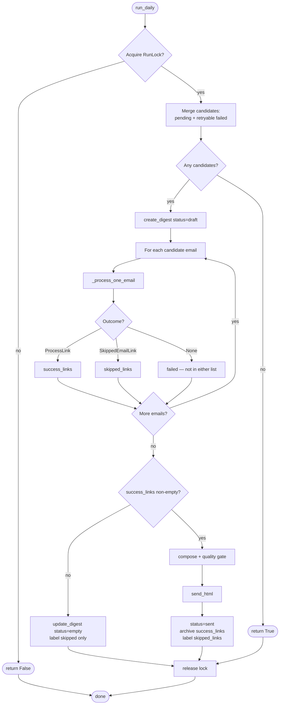
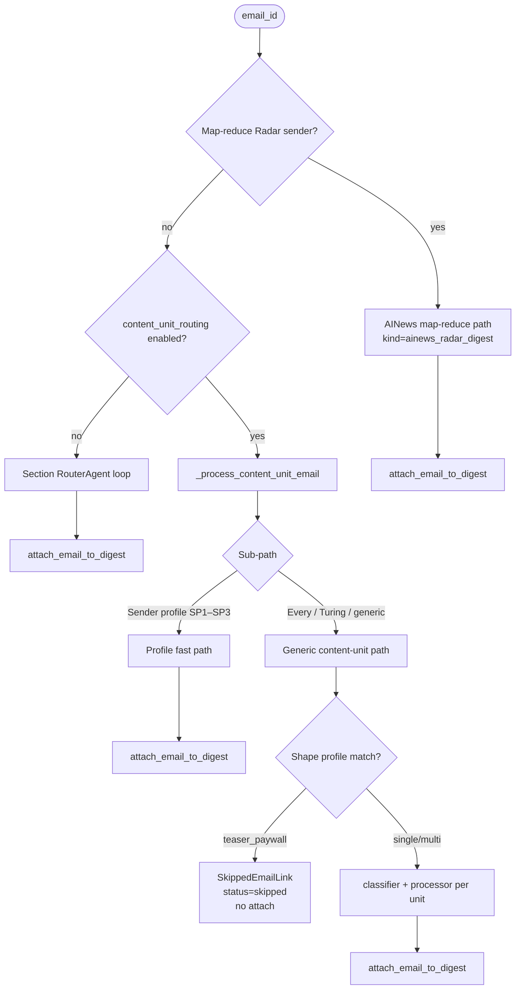

# Daily Digest Pipeline — Flowchart

**Status:** **Implemented** (production path)  
**Orchestrator:** `DailyDigestAgent.run_daily()` in `app/agents/daily_digest_agent.py`  
**Related:** [`architecture-diagram.md`](architecture-diagram.md), [`mixed-newsletter-shape-profile.md`](mixed-newsletter-shape-profile.md), [`sender-profiles.md`](sender-profiles.md), [`map-reduce-radar-design.md`](map-reduce-radar-design.md), [`implementation-status.md`](implementation-status.md)

Implementation-accurate end-to-end flow including AINews map-reduce, sender profiles, **newsletter shape profiles**, generic content-unit routing, cache reuse, quality gate, and Gmail label/archive semantics.

---

## 1. Daily run



---

## 2. Per-email routing (first match wins)



**Order in code:** map-reduce check → content-unit path → inside content-unit: **sender profile** before **shape grouping**.

---

## 3. Generic content-unit path (detail)

```text
fetch HTML → parse_newsletter_html
  → replace_email_sections
  → clear_section_scoped_agent_outputs
  → [optional] try_reuse_complete_outputs → attach + return

  → group_content_units(sections, original_url, sender)
       ├─ shape profile (every_to / turing_post):
       │     classify_newsletter_shape → build_shape_units
       │     persist kind=shape_classifier
       │     teaser_paywall → skip (no classifier/processor)
       └─ no profile: promo split + ambiguity heuristics [+ BC if ambiguous]

  → _resolve_content_units (BC fallback when ambiguous)
  → for each unit: ContentUnitClassifierAgent → ProcessorDispatcher
  → attach_email_to_digest
```

See [`mixed-newsletter-shape-profile.md`](mixed-newsletter-shape-profile.md) for shape rules.

---

## 4. Sender profile fast path (SP1–SP3)

```text
lookup_sender_profile(sender) → ProfileRunPlan
  → strip interrupts (P1a) → merge article body
  → forced category + dedicated processor (no per-unit LLM classifier on happy path)
  → cache by merged content_hash
  → structural counter-evidence → fall through to generic path
```

See [`sender-profiles.md`](sender-profiles.md).

---

## 5. Persistence touchpoints

| Step | Storage |
|------|---------|
| Ingest | `emails`, upsert by `message_id` |
| Parse | `email_sections` via `replace_email_sections` |
| Shape audit | `agent_outputs` `kind=shape_classifier` |
| Classify / process | `agent_outputs` `kind=classifier\|technology\|…` + `content_unit_key` |
| Digest join | `digest_emails` (success path only; **not** teaser skips) |
| Send | `digests.body_html`, `digests.status` |

Cache invalidation: changing section `content_hash` or clearing `agent_outputs` for an email forces reprocessing.

---

## 6. V1 sender → path matrix

| Sender | Path |
|--------|------|
| AINews (`MAP_REDUCE_RADAR_SENDERS`) | Map-reduce Radar |
| ByteByteGo, A Life Engineered, Latent Space `swyx@` | Sender profile fast path |
| Every (`hello@every.to`, …) | Content-unit + **`every_to` shape profile** |
| Turing Post (`turingpost@mail.beehiiv.com`) | Content-unit + **`turing_post` shape profile** |
| Other newsletters | Generic content-unit (group → classify → process) |

---

## 7. Changelog

| Date | Note |
|------|------|
| 2026-06-12 | Initial accurate flowchart (AINews + profile + generic) |
| 2026-06-16 | Added newsletter shape profile branch, `SkippedEmailLink`, skipped vs archived semantics |
