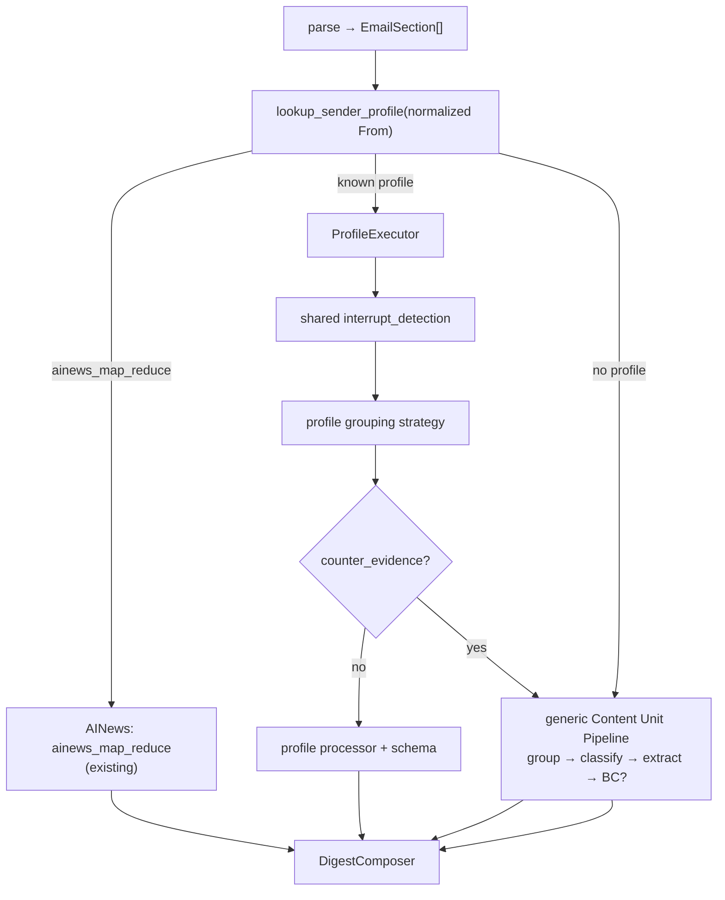

# Sender Profiles — Design Spec

**Status:** Planned — see [`implementation-status.md`](implementation-status.md)  
**Prerequisite (SP1):** [`interrupt-grouping.md`](interrupt-grouping.md) **P1a only** — interrupt detection + strippable/retained helpers. **Not** P1b generic bridge.  
**Related:** [`map-reduce-radar-design.md`](map-reduce-radar-design.md) (AINews), [`milestone8-content-unit-routing.md`](../milestone8-content-unit-routing.md), `app/parsing/sender_match.py`

---

## 1. Problem

Known newsletter senders are **highly predictable** in shape:

| Sender | Typical shape |
|--------|----------------|
| ByteByteGo | One tech essay; mid-article sponsor; chapter h2s |
| A Life Engineered | One leadership essay; author action items matter |
| Latent Space (`swyx@`) | One tech longform — interview **or** essay (same grouping) |
| AINews (`swyx+ainews@`) | Long Radar digest — **already specialized** |
| Turing Post | Tech article ± news roundup — **deferred** (Phase 8 dependency) |

Today every non-AINews email goes through the **generic** content-unit pipeline (group → classify → extract). That is correct for Every.to and anomalies, but wasteful and error-prone for the subscriptions above.

**Target:** **Profile fast path** for known senders; **generic pipeline as fallback** only on strong counter-evidence or unknown senders.

---

## 2. Layered architecture



| Layer | Responsibility | Publication-specific? |
|-------|----------------|----------------------|
| **Parse + sectionizer** | DOM sections, links, `original_url` | No |
| **Interrupt detection** ([`interrupt-grouping.md`](interrupt-grouping.md) §4) | Per-section `interrupt_role` | No |
| **Sender profile** | How to merge, default category, which processor | **Yes** (registry) |
| **Generic pipeline** | Full grouping + BC + classifier | No (Every, fallback) |

**Do not** duplicate “strip sponsor / footer” logic per profile — all profiles use shared interrupt detection ([`interrupt-grouping.md`](interrupt-grouping.md) §4.4), then apply their **merge strategy**.

### 2.1 P0 — Profile merge vs generic bridge

| Path | Grouping logic | Needs P1b bridge? |
|------|----------------|-------------------|
| `single_tech_article`, `single_leadership_essay`, `single_tech_longform` | Strip **strippable** interrupts → merge **all article-body** sections (`NORMAL_CONTENT` + `UNKNOWN_INTERRUPT`) | **No** |
| `tech_article_optional_radar` | **Deferred** — needs Phase 8 map-reduce | Phase 8 |
| Generic fallback (Every, counter-evidence) | Full interrupt-grouping Step 2 + BC | **Yes** |

ByteByteGo does **not** need cross-interrupt bridge scoring. Mislabeled `UNKNOWN_INTERRUPT` sections stay in the merged article unit (never hidden).

---

## 3. Sender Profile model

Central registry — **no** scattered `if sender == ...` in orchestration.

```python
class GroupingStrategy(StrEnum):
    AINEWS_MAP_REDUCE           = "ainews_map_reduce"
    SINGLE_TECH_ARTICLE         = "single_tech_article"
    SINGLE_LEADERSHIP_ESSAY     = "single_leadership_essay"
    SINGLE_TECH_LONGFORM        = "single_tech_longform"   # interview or essay — same merge
    TECH_ARTICLE_OPTIONAL_RADAR = "tech_article_optional_radar"  # deferred — Phase 8


@dataclass(frozen=True)
class SenderProfile:
    sender_email: str                    # normalized mailbox, e.g. bytebytego@substack.com
    strategy: GroupingStrategy
    default_category: RouteCategory
    processor: str                       # dispatch key → agent + prompt + schema

    fallback_strategy: str = "generic_content_unit"
    promo_handling: str = "strip_strippable_and_hide"   # §4.4 strippable only; UNKNOWN stays in body
    maximum_digest_cards: dict[str, int] = field(default_factory=dict)
    # Structural counter-evidence only — see §5.2 (processor failures are NOT here)
    counter_evidence_rules: tuple[str, ...] = (
        "promo_dominated",
        "empty_body",
    )
    skip_boundary_classifier: bool = True
    skip_content_unit_classifier: bool = True
```

Lookup: `normalize_sender_email(from_header)` from `app/parsing/sender_match.py` → `SENDER_PROFILES.get(email)`.

Persist per email: `sender_profile_applied`, `profile_fallback_triggered`, `fallback_reason` in `email_processing_decisions`.

---

## 4. Registry (initial)

```python
# V1 registry — Turing Post omitted until Phase 8 map-reduce (§6.4)
SENDER_PROFILES: dict[str, SenderProfile] = {
    "bytebytego@substack.com": SenderProfile(
        strategy=GroupingStrategy.SINGLE_TECH_ARTICLE,
        default_category=RouteCategory.TECHNOLOGY,
        processor="technology",
        maximum_digest_cards={"technology": 1},
        # V1: no multi_primary_url — citations must not trigger fallback (§5.1)
        counter_evidence_rules=("promo_dominated", "empty_body"),
    ),
    "alifeengineered@substack.com": SenderProfile(
        strategy=GroupingStrategy.SINGLE_LEADERSHIP_ESSAY,
        default_category=RouteCategory.LEADERSHIP,
        processor="leadership_essay",
        maximum_digest_cards={"leadership": 1},
    ),
    "swyx@substack.com": SenderProfile(
        strategy=GroupingStrategy.SINGLE_TECH_LONGFORM,
        default_category=RouteCategory.TECHNOLOGY,
        processor="technical_longform",   # picks interview vs essay schema internally
        maximum_digest_cards={"technology": 1},
    ),
    "swyx+ainews@substack.com": SenderProfile(
        strategy=GroupingStrategy.AINEWS_MAP_REDUCE,
        default_category=RouteCategory.RADAR,
        processor="ainews_radar_digest",
        skip_boundary_classifier=True,
        skip_content_unit_classifier=True,
    ),
}
```

**Explicitly no profile** for Every.to (`hello@every.to`), **Turing Post (V1)**, and unknown senders → generic pipeline by default.

Config file target: `config/sender_profiles.json` (or extend env allowlists); loaded at startup like `map_reduce_radar_senders`.

---

## 5. Counter-evidence & failures

### 5.1 Primary article URL (required before `multi_primary_url` fallback)

**P1:** `multi_primary_url` reintroduces the Every bug if “primary URL” includes body citations.

A **primary article URL** is:

| Counts | Does not count |
|--------|----------------|
| `parsed.original_url` / canonical post URL for this email | In-body citations (BBC, Forbes, docs links) |
| Per-section **card/title** link clearly pointing to a **separate** story | Footnote / reference links inside prose |
| Explicit “read full story” CTA to another article | ByteByteGo chapter inline references |

Implementation: `app/parsing/primary_links.py` — `collect_primary_article_url_keys()` for merge/split and fallback **only**.

**V1 ByteByteGo:** `counter_evidence_rules` **excludes** `multi_primary_url`. Prefer occasionally merging a rare multi-story issue into one card over re-splitting single essays. Re-enable `multi_primary_url` only after primary_links is tested on Every + ByteByteGo fixtures.

**Generic fallback / Every:** may use `multi_primary_url` once primary_links P0 is shipped.

### 5.2 Structural counter-evidence → generic fallback

Lightweight **structure** checks only. Any hit → `profile_fallback_triggered=True`, run generic pipeline.

| Rule ID | Condition | V1 ByteByteGo |
|---------|-----------|---------------|
| `multi_primary_url` | ≥2 distinct **primary article** URLs (§5.1) | **Off** |
| `promo_dominated` | After strip, merged body chars < threshold | On |
| `empty_body` | No substantive article-body text | On |
| `main_roundup_unresolved` | Turing Post only (deferred) | N/A |

**Not counter-evidence** (do **not** switch to generic pipeline):

| Event | Behavior |
|-------|----------|
| `processor_validation_failed` | **Whole email fails** — status `failed`, not attached, retry **same profile** next run |
| LLM timeout / API error | Same — fail email, no fallback |
| `maximum_digest_cards` exceeded | **Invariant violation** — fail email or explicit fallback with reason; see §10 |

Rationale: processor failure means extraction/schema broke, not that grouping strategy was wrong. Fallback would duplicate LLM work, mix profile + generic `agent_outputs`, and confuse cache/retry.

Persist: `sender_profile_applied`, `profile_fallback_triggered`, `fallback_reason` (structural only), `failure_reason` (runtime).

---

## 6. Per-profile rules

### 6.1 ByteByteGo — `SINGLE_TECH_ARTICLE`

**Known shape:** One complete technical article. H2/H3 are chapters. Mid-email sponsor. In-body links are citations, not separate stories.

**Grouping** (no bridge, no BC):

1. Run interrupt detection (P1a) on all sections.
2. **Strip** sections with strippable roles only: `PROMO`, `NAVIGATION`, `FOOTER`, `SUBSCRIPTION_CTA`.
3. **Merge all remaining article-body sections** (`NORMAL_CONTENT` + `UNKNOWN_INTERRUPT`) into **one** `ContentUnit`.
4. Do **not** run Boundary Classifier.
5. Do **not** run Content Unit Classifier — force `TECHNOLOGY`, `routing_source=sender_profile`.

Strippable interrupts may be separate hidden units. `UNKNOWN_INTERRUPT` never stripped — it remains in step 3 merge.

**Processor:** Existing `content_unit_technology` (one call).

**Digest:** Exactly **one** Technical Index card (`maximum_digest_cards.technology = 1`).

**Counter-evidence (V1):** `promo_dominated`, `empty_body` only — **not** `multi_primary_url`.

**Reference:** ByteByteGo Salesforce #163 → one unit `s0,s1,s3–s20`; `s2` promo hidden.

---

### 6.2 A Life Engineered — `SINGLE_LEADERSHIP_ESSAY`

**Known shape:** One leadership essay. Subheadings are argument sections. High value in author’s explicit recommendations.

**Grouping:** Same as §6.1 — strip strippable only; merge all article-body sections into one unit.

**Classification:** Force `LEADERSHIP` (skip classifier).

**Processor:** New `leadership_essay` — dedicated prompt + schema.

**Output schema:**

```python
class LeadershipEssayOutput(BaseModel):
    title: str
    core_thesis: str
    leadership_signals: list[str]
    author_action_items: list[str]      # faithful to source — do not invent
    senior_engineer_actions: list[str]  # model-derived personal execution advice
    notable_quotes_or_examples: list[str]
    original_url: str | None
```

**Field policy:**

| Field | Source |
|-------|--------|
| `author_action_items` | Verbatim or tight paraphrase of author-stated actions only |
| `senior_engineer_actions` | Model translation for a senior engineer reader |
| Must stay **separate** so digest readers never confuse model advice with author voice |

**Digest:** One Leadership card.

---

### 6.3 Latent Space — two senders

#### `swyx+ainews@substack.com` — `AINEWS_MAP_REDUCE`

**Do not merge** with `swyx@` handling. Use **existing** implementation:

- Gate: `MAP_REDUCE_RADAR_SENDERS` / profile `ainews_map_reduce`
- Agent: `AINewsRadarMapReduceAgent`
- Output: `kind=ainews_radar_digest`, AI Radar only

See [`map-reduce-radar-design.md`](map-reduce-radar-design.md). No interrupt grouping on this path.

#### `swyx@substack.com` — `SINGLE_TECH_LONGFORM`

**Known shape:** Usually interview transcript; sometimes single tech essay. **Same grouping** for both — one coherent longform, not one card per topic heading.

**Grouping:**

1. Strip **strippable** interrupts only.
2. Merge **all article-body** sections into **one** unit (`UNKNOWN_INTERRUPT` stays in body).
3. **Never** fall back to generic per-section routing because Q&A structure is missing.

**Classification:** Force `TECHNOLOGY`.

**Processor:** `technical_longform` — **one** merged unit in, schema chosen inside processor:

| Detected shape | Output schema |
|----------------|---------------|
| Interview / Q&A / speaker turns | `TechnicalInterviewOutput` |
| Essay / no interview structure | `TechnicalEssayOutput` (or standard `TechnologySectionOutput`) |

Interview detection failure → **essay schema**, not generic pipeline.

```python
class TechnicalInterviewOutput(BaseModel):
    title: str
    interviewees: list[str]
    central_topic: str
    key_technical_insights: list[str]
    architecture_or_workflow_insights: list[str]
    disagreements_or_tradeoffs: list[str]
    practical_takeaways: list[str]
    original_url: str | None
```

**Digest:** One Technical Index card.

**Counter-evidence (V1):** `promo_dominated`, `empty_body` only — same as other `single_*` profiles.

---

### 6.4 Turing Post — **deferred (Phase 8)**

**Status:** Planned — **not in V1 registry**.

**Conflict:** `TECH_ARTICLE_OPTIONAL_RADAR` requires Radar **map-reduce** for the NEWS_ROUNDUP bucket. Milestone 8 lists LINK_AGGREGATOR map-reduce as **Phase 8 non-goal**. Implementing Turing Post profile before Phase 8 creates a hidden cross-milestone dependency.

**V1:** Turing Post → **generic content-unit pipeline** (same as today).

**Future (with Phase 8):** MAIN_ARTICLE → one Technology unit; NEWS_ROUNDUP → map-reduce Radar unit; strippable interrupts hidden. See draft rules in git history / Phase 8 spec when written.

---

## 7. Generic Content Unit Pipeline (fallback)

Used when:

- No profile matches normalized sender
- Profile counter-evidence fires
- Explicit `fallback_strategy=generic_content_unit`

Flow (unchanged intent from Milestone 8):

```
interrupt_detection (shared)
→ content grouping ([interrupt-grouping.md](interrupt-grouping.md) Step 2)
→ Boundary Classifier if ambiguous
→ ContentUnitClassifierAgent per unit
→ ProcessorDispatcher
→ composer pair join
```

**Every.to** and mixed publications live here — no `single_*` profile.

---

## 8. Orchestration sketch

```python
def process_email(email_id, parsed, from_header):
    email = normalize_sender_email(from_header)
    profile = SENDER_PROFILES.get(email)

    if profile and profile.strategy == AINEWS_MAP_REDUCE:
        return process_ainews_map_reduce(...)   # existing

    if profile:
        interrupts = detect_interrupt_roles(parsed.sections)
        units = profile_executor.group(profile, parsed, interrupts)
        if structural_counter_evidence(profile, parsed, units):
            return process_generic_content_unit(..., fallback_reason=...)
        try:
            results = profile_executor.classify_and_process(profile, units, parsed)
            assert_digest_card_invariants(profile, results)  # §10 — fail, not truncate
        except (ProcessorError, ValidationError):
            mark_email_failed(email_id, failure_reason="processor_validation_failed")
            return  # retry same profile next run — no generic fallback
        return attach_to_digest(results, profile_applied=profile.sender_email)

    return process_generic_content_unit(...)
```

`ProfileExecutor` implements strategy-specific merge logic only; interrupt stripping is shared.

---

## 9. Classification & quality gates

On profile fast path:

| Step | Skipped? |
|------|----------|
| Boundary Classifier | Yes on profile fast path (`single_*`) |
| Content Unit Classifier | Yes — `default_category` forced, `routing_source=sender_profile` |
| Confidence band on processor output | **No** — validate schema; failures **fail email** (§5.2) |
| All-or-nothing email attach | **Yes** — policy unchanged |

Forced category is not a bypass for empty or invalid processor JSON. Processor failure ≠ structural counter-evidence.

---

## 10. Composer

| Path | Join key |
|------|----------|
| Profile technology / leadership_essay / technical_interview | `(email_id, content_unit_key)` or email-level processor row per profile convention |
| AINews | Existing `ainews_radar_digest` email-level row |
| Generic fallback | Existing Milestone 8 pair join |

### `maximum_digest_cards` — invariant, not truncate

**P2:** Do **not** silently drop cards when over cap.

| Check | On violation |
|-------|----------------|
| After grouping + processor, count digest cards per category vs `maximum_digest_cards` | `profile_invariant_violation` → **fail email** (preferred) or **explicit** structural fallback with logged reason |

Profile grouping should naturally produce the cap (e.g. one merge → one TI card). Exceeding the cap signals a bug, not a composer trimming opportunity.

Render `LeadershipEssayOutput.author_action_items` and `senior_engineer_actions` in distinct UI blocks.

---

## 11. Implementation phases

| Phase | Scope |
|-------|--------|
| **SP0** | `config/sender_profiles.json` + `lookup_sender_profile()` + decision logging |
| **SP1** | `SINGLE_TECH_ARTICLE` (ByteByteGo) — requires **interrupt-grouping P1a only** |
| **SP2** | `SINGLE_LEADERSHIP_ESSAY` + `LeadershipEssayOutput` + composer — P1a only |
| **SP3** | `SINGLE_TECH_LONGFORM` (`swyx@`) + `technical_longform` processor — P1a only |
| **SP4** | Wire AINews entry in registry (refactor gate only; behavior unchanged) |
| **SP5 (deferred)** | Turing Post + Phase 8 LINK_AGGREGATOR map-reduce |

**Prerequisite order:**

```
primary_links P0 (before multi_primary_url on any profile)
P1a (interrupt detection) ──► SP1 / SP2 / SP3 / SP4
P1b–d (generic bridge/BC)  ──► generic fallback + Every
Phase 8 map-reduce         ──► SP5 Turing Post
```

Do **not** block ByteByteGo on P1b or primary_links for V1 (ByteByteGo skips `multi_primary_url`).

---

## 12. Tests

| Test | Expect |
|------|--------|
| ByteByteGo Salesforce fixture | Profile path → 1 technology unit, 1 TI card, no BC, no bridge |
| ByteByteGo body with weak promo keyword | `UNKNOWN_INTERRUPT` → retained in article unit; not hidden |
| ByteByteGo body with citation URLs | Stays on profile path — citations not primary URLs |
| ByteByteGo multi-primary fixture | V1: still one card (no URL fallback); post-P0: optional fallback |
| ALE fixture | `author_action_items` populated from source; separate from `senior_engineer_actions` |
| `swyx@` interview fixture | 1 unit → `TechnicalInterviewOutput` |
| `swyx@` essay (no Q&A) | 1 unit → essay/technology schema — **not** generic fallback |
| Processor validation error | Email `failed`, same profile on retry |
| Digest card cap exceeded | `profile_invariant_violation` — fail, not truncate |
| AINews fixture | `ainews_map_reduce` only |
| Turing Post (V1) | No profile → generic pipeline |
| Every fixture | No profile → generic pipeline |
| Unknown sender | Generic pipeline |

---

## 13. Summary

| Sender | Strategy | Digest |
|--------|----------|--------|
| ByteByteGo | `single_tech_article` | 1 × Technical Index |
| A Life Engineered | `single_leadership_essay` | 1 × Leadership (dual action-item fields) |
| Latent Space `swyx@` | `single_tech_longform` | 1 × Technical Index |
| AINews `swyx+ainews@` | `ainews_map_reduce` | AI Radar (existing) |
| Turing Post (V1) | — | Generic pipeline until Phase 8 |
| Every / unknown / structural counter-evidence | `generic_content_unit` | Per-unit cards |

**Core principles:**

1. Sender Profile decides grouping + category + processor for predictable subscriptions.
2. Profile `single_*` strategies: strip **strippable** interrupts → merge article-body — **no generic bridge**.
3. `UNKNOWN_INTERRUPT` is never stripped or hidden (shared rule with interrupt-grouping §4.4).
4. **Structural** counter-evidence → generic fallback; **processor/runtime** failure → fail email, retry same profile.
5. **Primary article URL** excludes citations — V1 ByteByteGo omits `multi_primary_url` fallback.
6. Generic pipeline + P1b bridge remains the **safety net** for Every, not the default superhighway.

---

*Created: 2026-06-05 — companion to [`interrupt-grouping.md`](interrupt-grouping.md).*
