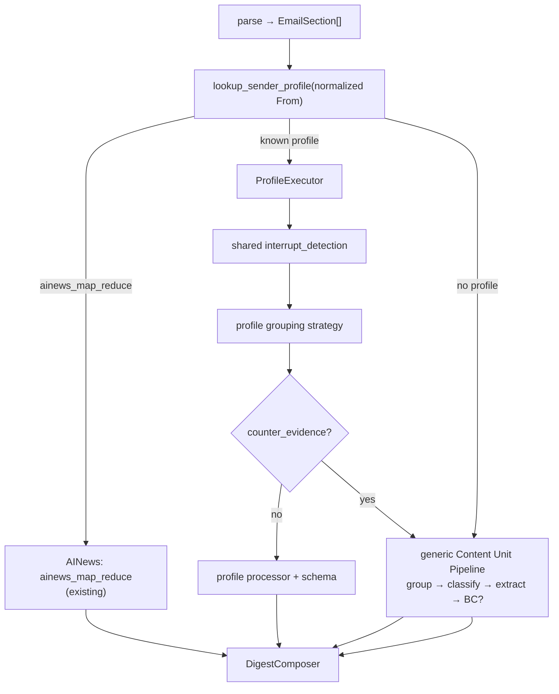

# Sender Profiles — Design Spec

**Status:** Planned  
**Prerequisite:** Shared [`interrupt-grouping.md`](interrupt-grouping.md) interrupt detection (Step 1)  
**Related:** [`map-reduce-radar-design.md`](map-reduce-radar-design.md) (AINews), [`milestone8-content-unit-routing.md`](../milestone8-content-unit-routing.md), `app/parsing/sender_match.py`

---

## 1. Problem

Known newsletter senders are **highly predictable** in shape:

| Sender | Typical shape |
|--------|----------------|
| ByteByteGo | One tech essay; mid-article sponsor; chapter h2s |
| A Life Engineered | One leadership essay; author action items matter |
| Latent Space (`swyx@`) | One tech interview transcript |
| AINews (`swyx+ainews@`) | Long Radar digest — **already specialized** |
| Turing Post | One tech article **or** tech article + news roundup |

Today every non-AINews email goes through the **generic** content-unit pipeline (group → classify → extract). That is correct for Every.to and anomalies, but wasteful and error-prone for the subscriptions above.

**Target:** **Profile fast path** for known senders; **generic pipeline as fallback** only on strong counter-evidence or unknown senders.

---

## 2. Layered architecture



| Layer | Responsibility | Publication-specific? |
|-------|----------------|----------------------|
| **Parse + sectionizer** | DOM sections, links, `original_url` | No |
| **Interrupt detection** ([`interrupt-grouping.md`](interrupt-grouping.md) §4) | Per-section `interrupt_role` | No |
| **Sender profile** | How to merge, default category, which processor | **Yes** (registry) |
| **Generic pipeline** | Full grouping + BC + classifier | No (Every, fallback) |

**Do not** duplicate “strip sponsor / footer” logic per profile — all profiles use shared interrupt detection, then apply their **merge strategy** on `NORMAL_CONTENT` sections only.

---

## 3. Sender Profile model

Central registry — **no** scattered `if sender == ...` in orchestration.

```python
class GroupingStrategy(StrEnum):
    AINEWS_MAP_REDUCE           = "ainews_map_reduce"
    SINGLE_TECH_ARTICLE         = "single_tech_article"
    SINGLE_LEADERSHIP_ESSAY     = "single_leadership_essay"
    SINGLE_TECH_INTERVIEW       = "single_tech_interview"
    TECH_ARTICLE_OPTIONAL_RADAR = "tech_article_optional_radar"


@dataclass(frozen=True)
class SenderProfile:
    sender_email: str                    # normalized mailbox, e.g. bytebytego@substack.com
    strategy: GroupingStrategy
    default_category: RouteCategory
    processor: str                       # dispatch key → agent + prompt + schema

    fallback_strategy: str = "generic_content_unit"
    promo_handling: str = "strip_and_hide"   # interrupts → separate units, hidden in digest
    maximum_digest_cards: dict[str, int] = field(default_factory=dict)
    counter_evidence_rules: tuple[str, ...] = (
        "multi_primary_url",
        "promo_dominated",
        "empty_body",
        "processor_validation_failed",
    )
    skip_boundary_classifier: bool = True
    skip_content_unit_classifier: bool = True
```

Lookup: `normalize_sender_email(from_header)` from `app/parsing/sender_match.py` → `SENDER_PROFILES.get(email)`.

Persist per email: `sender_profile_applied`, `profile_fallback_triggered`, `fallback_reason` in `email_processing_decisions`.

---

## 4. Registry (initial)

```python
SENDER_PROFILES: dict[str, SenderProfile] = {
    "bytebytego@substack.com": SenderProfile(
        strategy=GroupingStrategy.SINGLE_TECH_ARTICLE,
        default_category=RouteCategory.TECHNOLOGY,
        processor="technology",
        maximum_digest_cards={"technology": 1},
    ),
    "alifeengineered@substack.com": SenderProfile(
        strategy=GroupingStrategy.SINGLE_LEADERSHIP_ESSAY,
        default_category=RouteCategory.LEADERSHIP,
        processor="leadership_essay",
        maximum_digest_cards={"leadership": 1},
    ),
    "swyx@substack.com": SenderProfile(
        strategy=GroupingStrategy.SINGLE_TECH_INTERVIEW,
        default_category=RouteCategory.TECHNOLOGY,
        processor="technical_interview",
        maximum_digest_cards={"technology": 1},
    ),
    "swyx+ainews@substack.com": SenderProfile(
        strategy=GroupingStrategy.AINEWS_MAP_REDUCE,
        default_category=RouteCategory.RADAR,
        processor="ainews_radar_digest",
        skip_boundary_classifier=True,
        skip_content_unit_classifier=True,
    ),
    "turingpost@mail.beehiiv.com": SenderProfile(
        strategy=GroupingStrategy.TECH_ARTICLE_OPTIONAL_RADAR,
        default_category=RouteCategory.TECHNOLOGY,
        processor="technology_with_radar",
        maximum_digest_cards={"technology": 1, "radar": 2},
        skip_boundary_classifier=False,   # only when MAIN vs ROUNDUP unclear
    ),
}
```

**Explicitly no profile** for Every.to (`hello@every.to`) and unknown senders → generic pipeline by default.

Config file target: `config/sender_profiles.json` (or extend env allowlists); loaded at startup like `map_reduce_radar_senders`.

---

## 5. Counter-evidence (fallback triggers)

Lightweight checks only — **no** complex sanity engine. Any hit → `profile_fallback_triggered=True`, run generic pipeline.

| Rule ID | Condition |
|---------|-----------|
| `multi_primary_url` | ≥2 distinct primary article URLs in non-interrupt sections |
| `promo_dominated` | After stripping interrupts, merged body chars < threshold (e.g. 500) |
| `empty_body` | Zero `NORMAL_CONTENT` sections with substantive text |
| `processor_validation_failed` | Profile processor output fails Pydantic / quality gate |
| `interview_structure_missing` | `SINGLE_TECH_INTERVIEW` only: no Q&A / speaker-turn signals |
| `main_roundup_unresolved` | `TECH_ARTICLE_OPTIONAL_RADAR` only: cannot assign sections to MAIN vs ROUNDUP deterministically **and** BC unavailable or low confidence |

Record `fallback_reason` as the first rule ID that fired.

---

## 6. Per-profile rules

### 6.1 ByteByteGo — `SINGLE_TECH_ARTICLE`

**Known shape:** One complete technical article. H2/H3 are chapters. Mid-email sponsor. In-body links are citations, not separate stories.

**Grouping:**

1. Run interrupt detection on all sections.
2. Merge **all** `NORMAL_CONTENT` sections into **one** `ContentUnit` (sponsors/nav/footer are separate interrupt units, hidden).
3. Do **not** run Boundary Classifier on happy path.
4. Do **not** run Content Unit Classifier — force `TECHNOLOGY`, `routing_source=sender_profile`.

**Processor:** Existing `content_unit_technology` (one call).

**Digest:** Exactly **one** Technical Index card (`maximum_digest_cards.technology = 1`).

**Counter-evidence:** `multi_primary_url` (e.g. rare multi-story issue) → generic pipeline.

**Reference:** ByteByteGo Salesforce #163 → one unit `s0,s1,s3–s20`; `s2` promo hidden.

---

### 6.2 A Life Engineered — `SINGLE_LEADERSHIP_ESSAY`

**Known shape:** One leadership essay. Subheadings are argument sections. High value in author’s explicit recommendations.

**Grouping:** Same as §6.1 — merge all `NORMAL_CONTENT` into one unit.

**Classification:** Force `LEADERSHIP` (skip classifier).

**Processor:** New `leadership_essay` — dedicated prompt + schema.

**Output schema:**

```python
class LeadershipEssayOutput(BaseModel):
    title: str
    core_thesis: str
    leadership_signals: list[str]
    author_action_items: list[str]      # faithful to source — do not invent
    senior_engineer_actions: list[str]  # model-derived personal execution advice
    notable_quotes_or_examples: list[str]
    original_url: str | None
```

**Field policy:**

| Field | Source |
|-------|--------|
| `author_action_items` | Verbatim or tight paraphrase of author-stated actions only |
| `senior_engineer_actions` | Model translation for a senior engineer reader |
| Must stay **separate** so digest readers never confuse model advice with author voice |

**Digest:** One Leadership card.

---

### 6.3 Latent Space — two senders

#### `swyx+ainews@substack.com` — `AINEWS_MAP_REDUCE`

**Do not merge** with `swyx@` handling. Use **existing** implementation:

- Gate: `MAP_REDUCE_RADAR_SENDERS` / profile `ainews_map_reduce`
- Agent: `AINewsRadarMapReduceAgent`
- Output: `kind=ainews_radar_digest`, AI Radar only

See [`map-reduce-radar-design.md`](map-reduce-radar-design.md). No interrupt grouping on this path.

#### `swyx@substack.com` — `SINGLE_TECH_INTERVIEW`

**Known shape:** Podcast / interview transcript or deep technical conversation — one coherent piece, not one card per topic heading.

**Grouping:**

1. Strip interrupts (sponsor, show notes nav, CTA, footer).
2. Merge **all** `NORMAL_CONTENT` into **one** unit (do not split on interview topic h2s).

**Classification:** Force `TECHNOLOGY`.

**Processor:** New `technical_interview`.

**Output schema:**

```python
class TechnicalInterviewOutput(BaseModel):
    title: str
    interviewees: list[str]
    central_topic: str
    key_technical_insights: list[str]
    architecture_or_workflow_insights: list[str]
    disagreements_or_tradeoffs: list[str]
    practical_takeaways: list[str]
    original_url: str | None
```

**Digest:** One Technical Index card.

**Counter-evidence:** `interview_structure_missing` or `multi_primary_url` → generic pipeline (non-interview longform).

---

### 6.4 Turing Post — `TECH_ARTICLE_OPTIONAL_RADAR`

**Known shape:** Sometimes one tech main article only; sometimes main article + news roundup blocks.

**Step A — structural role assignment** (per section, after interrupt detection):

| Role | Meaning |
|------|---------|
| `MAIN_ARTICLE` | Longform tech feature |
| `NEWS_ROUNDUP` | Short news pulses / links roundup |
| `PROMO` / other interrupts | From interrupt detection |

Use deterministic rules first (heading patterns, relative length, link density, newsletter section labels). If MAIN vs ROUNDUP cannot be assigned confidently → **Boundary Classifier** (only for this partition question).

**Step B — grouping:**

| Role bucket | Content unit | Category | Processor |
|-------------|--------------|----------|-----------|
| All `MAIN_ARTICLE` | One merged unit | TECHNOLOGY | `technology` (or shared main-article extract) |
| All `NEWS_ROUNDUP` | One merged unit | RADAR | Reuse map-reduce chunking + recap reduce (subset of AINews machinery) |
| Interrupts | Singleton units | COURSES / hidden | Skip or courses |

**Digest caps:** 1 Technical Index + ≤2 Radar cards + optional hidden promo.

**Counter-evidence:** `main_roundup_unresolved` after BC → generic pipeline.

---

## 7. Generic Content Unit Pipeline (fallback)

Used when:

- No profile matches normalized sender
- Profile counter-evidence fires
- Explicit `fallback_strategy=generic_content_unit`

Flow (unchanged intent from Milestone 8):

```
interrupt_detection (shared)
→ content grouping ([interrupt-grouping.md](interrupt-grouping.md) Step 2)
→ Boundary Classifier if ambiguous
→ ContentUnitClassifierAgent per unit
→ ProcessorDispatcher
→ composer pair join
```

**Every.to** and mixed publications live here — no `single_*` profile.

---

## 8. Orchestration sketch

```python
def process_email(email_id, parsed, from_header):
    email = normalize_sender_email(from_header)
    profile = SENDER_PROFILES.get(email)

    if profile and profile.strategy == AINEWS_MAP_REDUCE:
        return process_ainews_map_reduce(...)   # existing

    if profile:
        interrupts = detect_interrupt_roles(parsed.sections)
        units = profile_executor.group(profile, parsed, interrupts)
        if counter_evidence(profile, parsed, units):
            return process_generic_content_unit(..., fallback_reason=...)
        results = profile_executor.classify_and_process(profile, units, parsed)
        return attach_to_digest(results, profile_applied=profile.sender_email)

    return process_generic_content_unit(...)
```

`ProfileExecutor` implements strategy-specific merge logic only; interrupt stripping is shared.

---

## 9. Classification & quality gates

On profile fast path:

| Step | Skipped? |
|------|----------|
| Boundary Classifier | Yes, except Turing MAIN/ROUNDUP gray zone |
| Content Unit Classifier | Yes — `default_category` forced, `routing_source=sender_profile` |
| Confidence band on processor output | **No** — validate schema; failures trigger `processor_validation_failed` fallback |
| All-or-nothing email attach | **Yes** — policy unchanged |

Forced category is not a bypass for empty or invalid processor JSON.

---

## 10. Composer

| Path | Join key |
|------|----------|
| Profile technology / leadership_essay / technical_interview | `(email_id, content_unit_key)` or email-level processor row per profile convention |
| AINews | Existing `ainews_radar_digest` email-level row |
| Turing hybrid | One TI pair + one Radar pair (or map-reduce digest row) |
| Generic fallback | Existing Milestone 8 pair join |

Enforce `maximum_digest_cards` per profile — warn or truncate if exceeded.

Render `LeadershipEssayOutput.author_action_items` and `senior_engineer_actions` in distinct UI blocks.

---

## 11. Implementation phases

| Phase | Scope |
|-------|--------|
| **SP0** | `config/sender_profiles.json` + `lookup_sender_profile()` + decision logging |
| **SP1** | `SINGLE_TECH_ARTICLE` (ByteByteGo) + shared interrupt detection dependency |
| **SP2** | `SINGLE_LEADERSHIP_ESSAY` + `LeadershipEssayOutput` + composer |
| **SP3** | `SINGLE_TECH_INTERVIEW` + `TechnicalInterviewOutput` |
| **SP4** | `TECH_ARTICLE_OPTIONAL_RADAR` (Turing Post) — highest complexity |
| **SP5** | Wire AINews entry in registry (refactor gate only; behavior unchanged) |

**Prerequisite order:** interrupt-grouping P1a–b before SP1 (shared strip/merge).

---

## 12. Tests

| Test | Expect |
|------|--------|
| ByteByteGo Salesforce fixture | Profile path → 1 technology unit, 1 TI card, no BC |
| ByteByteGo multi-URL fixture | `multi_primary_url` → generic fallback |
| ALE fixture | `author_action_items` populated from source; separate from `senior_engineer_actions` |
| `swyx@` interview fixture | 1 technical_interview unit |
| `swyx@` essay (no Q&A) | `interview_structure_missing` → fallback |
| AINews fixture | `ainews_map_reduce` only; profile registry does not alter behavior |
| Turing main+roundup | 1 TI + 1–2 Radar |
| Every fixture | No profile → generic pipeline |
| Unknown sender | Generic pipeline |

---

## 13. Summary

| Sender | Strategy | Digest |
|--------|----------|--------|
| ByteByteGo | `single_tech_article` | 1 × Technical Index |
| A Life Engineered | `single_leadership_essay` | 1 × Leadership (dual action-item fields) |
| Latent Space `swyx@` | `single_tech_interview` | 1 × Technical Index |
| AINews `swyx+ainews@` | `ainews_map_reduce` | AI Radar (existing) |
| Turing Post | `tech_article_optional_radar` | 1 TI + optional Radar |
| Every / unknown / counter-evidence | `generic_content_unit` | Per-unit cards |

**Core principle:** Sender Profile decides grouping + category + processor for predictable subscriptions; generic pipeline remains the **safety net**, not the default superhighway.

---

*Created: 2026-06-05 — companion to [`interrupt-grouping.md`](interrupt-grouping.md).*
